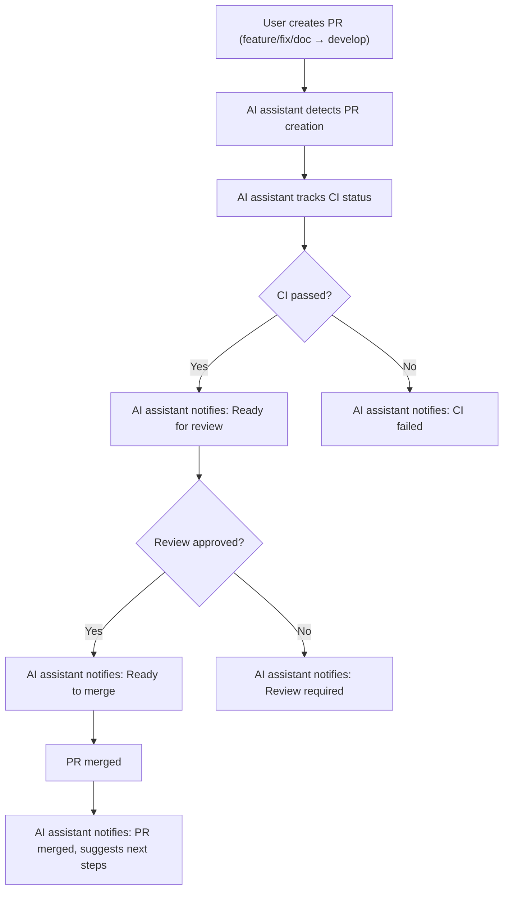

# Core Development Principles

These principles ensure high quality, security, and maintainability for any modern project. Use them as a checklist for all decisions and code reviews.

## The 10 Principles
1. **Do No Harm** — Prioritize security and backward compatibility
2. **Fail Fast, Fail Safe** — Detect and handle errors early and safely
3. **Data Integrity & Privacy** — Protect user data and ensure consistency
4. **Observability First** — Structured logging, metrics, and monitoring
5. **Best Practices First** — Use proven patterns and standards
6. **Configuration as Code** — Version and validate all configs
7. **Progressive Enhancement** — Core features always work, add enhancements incrementally
8. **Continuous Learning** — Monitor, gather feedback, and improve
9. **Ecosystem Thinking** — Ensure plugin/API compatibility and stability
10. **AI-First Documentation** — Write analytical comments for AI and human understanding

<<<<<<< HEAD
## Workflow & Branch Protection
- Direct commits or merges to `main` and `develop` are strictly forbidden. All changes must go through pull requests into `develop` only.
- Merging to `main` is allowed only from `develop` after release approval.
- All PRs must include documentation links and changelog updates.

### Example: Merge Protection
- ✅ feature/sidepanel-e2e → PR → develop → PR → main (release)
- ❌ direct commit to main (forbidden)
- ❌ direct commit to develop (forbidden)
- ✅ fix/plugin-card-bug → PR → develop

## Automated PR Status Tracking
- The AI assistant automatically tracks the status of all current and future Pull Requests (PR):
  - Creation, review, CI checks, merge, and closure are monitored.
  - Any status change (new comment, approval, CI, merge) triggers a notification to the user in chat.
  - This mechanism works for all branches and PRs following the workflow (feature/fix/doc → PR → develop → PR → main).
  - Status can be requested manually or received automatically.
- This practice accelerates review, reduces bottlenecks, and increases process transparency.

**Process Visualization:**

### Example Scenario
1. User creates a PR from feature/sidepanel-e2e to develop.
2. The AI assistant notifies about PR creation and tracks CI status.
3. After successful CI and review, the AI assistant notifies that the PR is ready to merge.
4. After merge, the assistant notifies about completion and suggests next steps.

### Cross-References
- [Progress: PR Status Automation](../../memory-bank/progress.md#автоматизация-отслеживание-статуса-pull-request)
- [Workflow & Branch Protection](#workflow--branch-protection)

## Branch Purpose Tracking
- Before starting a new task unrelated to the current branch's purpose:
  - Complete all work in the current branch: commit, push, create a Pull Request, and wait for merge.
  - Only after merging the current branch is it allowed to create a new branch for the next task.
  - This prevents mixing tasks, improves history clarity, and simplifies review.
  - Exceptions are allowed only for urgent bugfixes (fix/), which must be handled in a separate branch.

**Automated Protection:**
- The project implements a pre-commit and pre-push hook (`bash-scripts/prevent-branch-mixing.sh`) that blocks commits and pushes if the task type in the commit message does not match the branch type (feature/, fix/, chore/, docs/, refactor/).
- If task mixing is detected, the commit/push is blocked with an explanation.
- This rule is documented in .cursor/rules, best practices, and the AI-memory-bank.

### Cross-References
- [Progress: Branch Purpose Tracking](../../memory-bank/progress.md#правило-отслеживание-смысла-ветки-и-завершение-задач)
- [.cursor/rules/workflow/branches.mdc]

=======
>>>>>>> origin/develop
## How to Apply
- Analyze each task through the lens of these principles
- Select the most relevant principles for the situation
- Apply them systematically in decisions and code
- Document how principles influenced your solution

## Example Applications
- **New plugin:** 1, 2, 5, 6, 9, 10
- **Bugfix:** 1, 2, 4, 5, 7
- **Optimization:** 2, 4, 5, 6, 7, 8
- **New feature:** 1, 3, 5, 7, 8, 9

## Synergy
- "Do No Harm" + "Fail Fast" = Safe, rapid solutions
- "Best Practices" + "Observability" = Quality with monitoring
- "Progressive Enhancement" + "Ecosystem" = Stable ecosystem
- "Data Privacy" + "Configuration" = Secure configuration

## Result
Following these principles ensures:
- High code and architecture quality
- Security and reliability
- Great user experience
- Scalability and maintainability
- A successful plugin ecosystem

## Cross-References
- [Project README](../../README.md)
- [Roadmap & Progress](../../memory-bank/progress.md)
- [Cursor Rules System](../cursor-rules-system.md) 