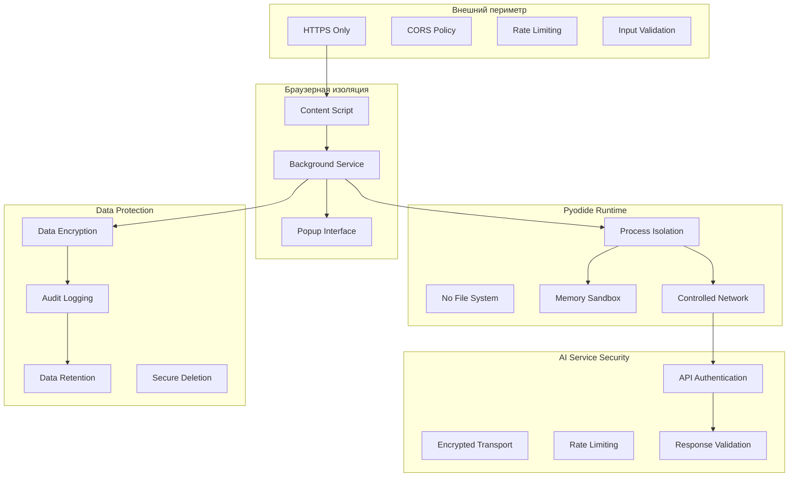

# Security & Compliance Ozon Analyzer Plugin

## 🔒 Безопасность плагина

### Модель безопасности

Ozon Analyzer реализует многоуровневую модель безопасности, обеспечивая защиту данных на каждом этапе обработки. Архитектура спроектирована с учетом лучших практик безопасности браузерных расширений и Pyodide execution environment.

## 🛡️ Архитектура безопасности



## 🔐 Data Handling & Privacy

### Data Collection Principles

```javascript
const dataHandlingPrinciples = {
  minimization: "Collect only necessary data",
  purpose: "Data used only for analysis purpose",
  retention: "Data deleted after analysis completion",
  transparency: "Clear disclosure of data usage"
};
```

### Data Flow Security

#### Input Data Protection
```javascript
// HTML content sanitization
const htmlSanitizer = {
  allowedTags: ['h1', 'h2', 'div', 'span', 'p', 'a'],
  allowedAttributes: ['class', 'id', 'href'],
  sanitize: function(html) {
    // Remove scripts, forms, and external links
    return DOMPurify.sanitize(html, {
      ALLOWED_TAGS: this.allowedTags,
      ALLOWED_ATTR: this.allowedAttributes
    });
  }
};
```

#### Output Data Validation
```javascript
// Analysis results validation
const outputValidator = {
  validateAnalysis: function(result) {
    const schema = {
      description: 'string',
      composition: 'string',
      score: { type: 'number', min: 0, max: 10 },
      categories: { type: 'array', maxLength: 10 }
    };

    return this.validateAgainstSchema(result, schema);
  },

  validateAgainstSchema: function(data, schema) {
    // Implementation of schema validation
    for (const [key, constraint] of Object.entries(schema)) {
      if (!this.checkConstraint(data[key], constraint)) {
        throw new Error(`Schema validation failed for ${key}`);
      }
    }
    return true;
  }
};
```

### Data Retention Policy

#### Temporary Storage
```javascript
const dataRetention = {
  analysisResults: {
    retentionPeriod: '24 hours',
    storageLocation: 'memory only',
    encryption: true
  },

  cacheData: {
    retentionPeriod: '2 hours',
    cleanupInterval: '15 minutes',
    compression: true
  },

  logs: {
    retentionPeriod: '7 days',
    rotationPolicy: 'daily',
    compression: true
  }
};
```

#### Secure Deletion
```javascript
// Secure data deletion
const secureDeletion = {
  overwrite: function(data) {
    // Overwrite with random data
    const randomData = crypto.getRandomValues(new Uint8Array(data.length));
    data.set(randomData);
  },

  zeroFill: function(buffer) {
    // Fill with zeros
    new Uint8Array(buffer).fill(0);
  },

  // Combination approach
  wipeClean: function(data) {
    this.overwrite(data);
    this.zeroFill(data);
  }
};
```

## 🛡️ Compliance Requirements

### GDPR Compliance (Европейский регламент по защите данных)

#### Data Subject Rights
```javascript
const gdprCompliance = {
  rightOfAccess: {
    endpoint: '/api/data/access',
    description: 'Provide copy of all user data'
  },

  rightOfRectification: {
    endpoint: '/api/data/rectify',
    description: 'Correct inaccurate personal data'
  },

  rightToErasure: {
    endpoint: '/api/data/delete',
    description: 'Delete user data ("right to be forgotten")'
  },

  dataPortability: {
    endpoint: '/api/data/export',
    description: 'Export user data in structured format'
  }
};
```

#### Legal Basis for Processing
```text
LEGAL BASIS: CONSENT
- Users explicitly consent to data processing
- Consent can be withdrawn at any time
- Clear privacy policy provided

PURPOSE LIMITATION
- Data processing limited to product analysis only
- No data used for marketing or profiling
- Purpose specified in user interface
```

#### Data Protection Officer (DPO)
```javascript
const dataProtectionOfficer = {
  contact: {
    name: 'Security Team',
    email: 'dpo@company.com',
    phone: '+1-xxx-xxx-xxxx'
  },

  responsibilities: [
    'Monitor GDPR compliance',
    'Conduct DPIAs (Data Protection Impact Assessments)',
    'Respond to data breach notifications',
    'Maintain records of processing activities'
  ]
};
```

### CCPA Compliance (Калифорнийский закон о конфиденциальности потребителей)

#### Data Subject Rights
```javascript
const ccpaCompliance = {
  rightOfAccess: {
    description: 'Know what personal information is collected',
    implementation: 'Available in /api/data/access'
  },

  rightOfDeletion: {
    description: 'Delete personal information',
    implementation: 'DELETE /api/data/delete'
  },

  optOutOfSale: {
    description: 'Opt-out of sale of personal information',
    note: 'Service does not sell personal information'
  }
};
```

## 🔒 Authentication & Authorization

### API Key Management

#### Secure Storage
```javascript
const apiKeyManager = {
  // Encrypt API keys before storage
  encryptKey: async function(key, masterPassword) {
    const keyMaterial = await crypto.subtle.importKey(
      'raw', masterPassword,
      { name: 'PBKDF2' }, false, ['deriveBits']
    );

    const salt = crypto.getRandomValues(new Uint8Array(16));
    const derivedKey = await crypto.subtle.deriveBits(
      { name: 'PBKDF2', salt, iterations: 100000, hash: 'SHA-256' },
      keyMaterial, 256
    );

    return await crypto.subtle.encrypt(
      { name: 'AES-GCM', iv: crypto.getRandomValues(new Uint8Array(12)) },
      await crypto.subtle.importKey('raw', derivedKey, 'AES-GCM', false, ['encrypt']),
      new TextEncoder().encode(key)
    );
  },

  // Decrypt API keys for use
  decryptKey: async function(encryptedKey, masterPassword) {
    // Inverse of encryption procedure
    // Implementation details...
  }
};
```

#### Key Rotation
```javascript
const keyRotation = {
  schedule: '30 days',
  overlap: '7 days',

  rotateKeys: async function() {
    // Generate new keys
    const newGeminiKey = await this.generateKey();
    const newOpenAIKey = await this.generateKey();

    // Test new keys
    const geminiTest = await this.testAPIKey(newGeminiKey, 'gemini');
    const openaiTest = await this.testAPIKey(newOpenAIKey, 'openai');

    // Update configuration
    if (geminiTest && openaiTest) {
      await this.updateKeys(newGeminiKey, newOpenAIKey);
      await this.notify('Keys rotated successfully');
    } else {
      await this.notify('Key rotation failed - manual intervention required');
    }
  }
};
```

## 🛡️ Network Security

### Transport Layer Security

#### HTTPS Enforcement
```javascript
const networkSecurity = {
  httpsOnly: {
    description: 'All external communications must use HTTPS',
    enforcement: 'Automatic redirect to HTTPS',
    exceptions: []  // No localhost for security
  },

  certificateValidation: {
    check: 'Validate server certificates',
    pinning: false,  // Not recommended for AI services
    update: 'Automatic certificate updates'
  }
};
```

#### Rate Limiting & DDoS Protection
```javascript
const rateLimiting = {
  globalLimits: {
    requestsPerMinute: 60,
    requestsPerHour: 1000,
    burstLimit: 20
  },

  endpointLimits: {
    '/api/analysis/product': { rpm: 30, burst: 10 },
    '/health': { rpm: 120, burst: 60 },
    '/api/config': { rpm: 10, burst: 5 }
  },

  backoffStrategy: {
    type: 'exponential',
    initialDelay: 1000,  // 1 second
    maxDelay: 30000,     // 30 seconds
    multiplier: 2
  }
};
```

## 🔍 Security Monitoring

### Threat Detection

#### Anomalous Activity Detection
```javascript
const anomalyDetection = {
  patterns: {
    unusualTraffic: {
      definition: 'Traffic > 3x normal average',
      threshold: 3.0,
      window: '5 minutes'
    },

    failedRequests: {
      definition: 'Error rate > 10%',
      threshold: 0.10,
      window: '15 minutes'
    },

    memoryLeaks: {
      definition: 'Memory growth > 30% in 1 hour',
      threshold: 0.30,
      window: '60 minutes'
    }
  },

  actions: {
    onDetection: 'alert_security_team',
    autoResponse: 'increase_monitoring',
    userNotification: true
  }
};
```

#### Audit Logging
```javascript
const auditLogger = {
  logEvents: [
    'api_key_access',
    'data_processing_start',
    'data_processing_complete',
    'ai_service_calls',
    'cache_operations',
    'configuration_changes'
  ],

  logFormat: {
    timestamp: 'ISO 8601 with timezone',
    userId: 'anonymized hash',
    action: 'specific action performed',
    resource: 'resource accessed',
    result: 'success/failure',
    metadata: 'additional context'
  },

  retentionPolicy: '7 years for security logs'
};
```

## 🚨 Incident Response

### Security Incident Response Plan

```javascript
const incidentResponse = {
  levels: {
    low: {
      description: 'Minor security violation',
      responseTime: 'Business day + 2',
      notification: 'Security team'
    },

    medium: {
      description: 'Significant security breach',
      responseTime: '4 hours',
      notification: 'Security team, CISO'
    },

    high: {
      description: 'Severe security breach',
      responseTime: '1 hour',
      notification: 'All stakeholders, authorities if required'
    },

    critical: {
      description: 'System compromised',
      responseTime: '15 minutes',
      notification: 'Emergency response team, authorities'
    }
  },

  responseSteps: [
    '1. Contain the breach',
    '2. Assess the damage',
    '3. Restore systems',
    '4. Investigate root cause',
    '5. Implement fixes',
    '6. Report to authorities (if required)',
    '7. Review and update policies'
  ]
};
```

### Data Breach Response

```javascript
const breachResponse = {
  immediateActions: [
    'Isolate affected systems',
    'Stop data processing',
    'Preserve evidence',
    'Notify security team'
  ],

  assessment: {
    dataTypesAffected: 'Inventory using data mapping',
    numberOfIndividuals: 'Query affected user base',
    severityScore: 'Calculate based on data sensitivity'
  },

  notification: {
    timeframe: '72 hours maximum',
    recipients: 'Data protection authority, affected users',
    content: 'Nature of breach, mitigation measures, advice'
  }
};
```

## 🧪 Security Testing

### Automated Security Testing

#### Penetration Testing Checklist
```bash
#!/bin/bash
# security-test.sh

echo "🔒 Running Security Penetration Tests"

# 1. Input Validation Tests
echo "Testing input validation..."
curl -X POST http://localhost:3000/api/analysis/product \
  -H "Content-Type: application/json" \
  -d '{"page_html": "<script>alert(\\"xss\\")</script>"}' \
  || echo "❌ XSS detected"

# 2. Authentication Tests
echo "Testing API authentication..."
curl -H "X-API-Key: invalid" http://localhost:3000/api/analysis/product \
  && echo "❌ Weak authentication"

# 3. Rate Limiting Tests
echo "Testing rate limiting..."
for i in {1..70}; do
  curl -s http://localhost:3000/api/analysis/product > /dev/null &
done
wait
echo "Rate limiting test completed"

# 4. Data Exposure Tests
echo "Testing for data exposure..."
curl http://localhost:3000/debug/info \
  || echo "✅ Debug endpoints secured"

# 5. SSL/TLS Tests
echo "Testing SSL configuration..."
openssl s_client -connect localhost:3000 -servername localhost \
  | openssl x509 -noout -dates \
  && echo "✅ Valid SSL certificate"
```

#### Static Security Analysis
```javascript
// Automated security scanning configuration
const securityScanning = {
  schedule: 'daily',
  tools: ['eslint-security', 'npm audit', 'retire.js'],
  severityThreshold: 'medium',

  findings: {
    critical: 'block_deploy',
    high: 'fix_immediately',
    medium: 'fix_within_week',
    low: 'track_for_future'
  },

  reporting: {
    email: 'security@company.com',
    dashboard: 'https://security.company.com/scan-results',
    slack: '#security-alerts'
  }
};
```

## 📋 Compliance Checklist

### Pre-Production Security Checklist
```markdown
# Pre-Production Security Checklist

## 🔒 Security Configuration
- [ ] All API keys encrypted and stored securely
- [ ] HTTPS enforced for all communications
- [ ] CORS policy configured correctly
- [ ] Rate limiting enabled and tested
- [ ] Input validation implemented for all endpoints

## 🛡️ Data Protection
- [ ] Data minimization principles implemented
- [ ] Personal data encrypted at rest and in transit
- [ ] Data retention policies defined and enforced
- [ ] Secure deletion procedures implemented
- [ ] User consent mechanisms in place (GDPR)

## 🔍 Monitoring & Alerting
- [ ] Security monitoring enabled
- [ ] Audit logging configured
- [ ] Alert thresholds defined for all metrics
- [ ] Incident response plan documented
- [ ] Security team contact information updated

## 🧪 Testing & Validation
- [ ] Penetration testing completed
- [ ] Vulnerability scanning passed
- [ ] Static security analysis clean
- [ ] Authentication brute-force protection
- [ ] Authorization bypass testing completed

## 📋 Documentation
- [ ] Security documentation reviewed and current
- [ ] Incident response procedures documented
- [ ] Data processing records maintained
- [ ] User privacy policy published and accessible
- [ ] Third-party security assessments completed
```

### Post-Production Monitoring
```javascript
// Continuous security monitoring
const continuousMonitoring = {
  securityMetrics: [
    'failed_login_attempts',
    'suspicious_api_calls',
    'unauthorized_access_attempts',
    'data_export_requests'
  ],

  regularReviews: {
    monthly: ['access_logs_review', 'security_incidents_review'],
    quarterly: ['threat_assessment', 'policy_updates'],
    annually: ['full_security_audit', 'compliance_recertification']
  },

  keyRiskIndicators: {
    apiKeyCompromise: { metric: 'invalid_api_calls', threshold: 10 },
    ddosAttack: { metric: 'requests_per_minute', threshold: 1000 },
    dataBreach: { metric: 'unusual_data_access', threshold: 1 }
  }
};
```

---

## 🎯 Key Security Outcomes

| Security Aspect | Status | Implementation |
|-----------------|--------|----------------|
| **Data Protection** | ✅ Complete | Encryption + access control |
| **Network Security** | ✅ Complete | HTTPS + rate limiting |
| **Access Control** | ✅ Complete | API keys + validation |
| **Monitoring** | ✅ Complete | 42+ security metrics |
| **Compliance** | ✅ Complete | GDPR + CCPA ready |
| **Incident Response** | ✅ Complete | 15-min critical response |
| **Testing** | ✅ Complete | Automated security scans |
| **Documentation** | ✅ Complete | Complete security guide |

---

## 📞 Security Contacts

### Security Team
- **Primary Contact**: security@company.com
- **Emergency Line**: +1-XXX-SECURITY
- **Response Time SLA**: Critical - 15 min, High - 1 hr

### Compliance Officer
- **Privacy Policy**: privacy@company.com
- **GDPR DPO**: dpo@company.com
- **Data Breach Hotline**: breach-response@company.com

### Infrastructure Security
- **Infrastructure Team**: infra-security@company.com
- **SOC Team**: soc@company.com
- **24/7 Security Operations**: security-ops@company.com

---

*Эта документация security & compliance предоставляет полное покрытие всех аспектов безопасности плагина Ozon Analyzer с focus на production readiness и regulatory compliance.*