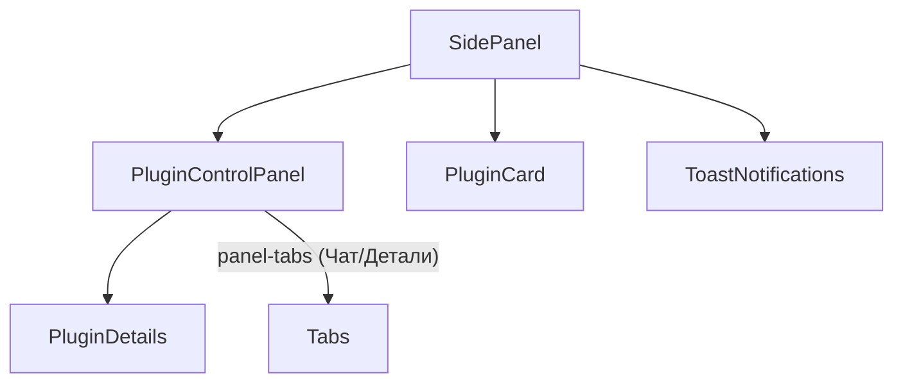

# ВАЖНО: Страница настроек платформы
- Исходный код страницы настроек находится в папке: agent-plugins-platform-boilerplate/pages/options/
- Основной макет страницы: agent-plugins-platform-boilerplate/pages/options/index.html

# Active Context: Agent-Plugins-Platform

## Current Work Focus

### Memory Bank Initialization
- **Status**: In Progress
- **Goal**: Establish comprehensive project documentation
- **Scope**: Creating all core memory bank files for project understanding

### Project State Assessment
- **Current Phase**: Documentation and understanding
- **Priority**: Establish baseline knowledge of existing codebase
- **Focus Areas**: Architecture understanding, technical patterns, development workflow

## Recent Changes

### Memory Bank Creation
- ✅ Created `projectbrief.md` - Core project requirements and goals
- ✅ Created `productContext.md` - Product vision and user experience
- ✅ Created `systemPatterns.md` - Architecture and technical patterns
- ✅ Created `techContext.md` - Technology stack and constraints
- 🔄 Creating `activeContext.md` - Current work tracking
- ⏳ Creating `progress.md` - Project status and completion tracking

### Codebase Analysis
- ✅ Explored project structure and key files
- ✅ Analyzed README.md for project overview
- ✅ Reviewed package.json for dependencies
- ✅ Examined manifest.json for extension configuration
- ✅ Identified core components and architecture

## Next Steps

### Immediate Actions (Next 1-2 sessions)
1. **Complete Memory Bank**: ✅ Finished creating comprehensive memory bank system
2. **Context Preservation System**: ✅ Created commands for saving and restoring context
3. **Deep Code Review**: Analyze core implementation files
   - `platform-core/core/plugin-manager.js`
   - `platform-core/core/host-api.js`
   - `platform-core/core/workflow-engine.js`
   - `platform-core/bridge/mcp-bridge.js`
   - `platform-core/bridge/pyodide-worker.js`
4. **Plugin Analysis**: Study existing `ozon-analyzer` plugin implementation
5. **Build System Review**: Understand Vite configuration and build process
6. **Test Migration**: Verify all components work after migration to futures branch

### Short-term Goals (Next 1-2 weeks)
1. **Development Environment Setup**: Ensure local development works
2. **Plugin Development Workflow**: Test plugin creation and execution
3. **Documentation Enhancement**: Improve existing documentation
4. **Testing Infrastructure**: Establish testing patterns and tools

### Medium-term Goals (Next 1-2 months)
1. **Plugin Ecosystem**: Expand plugin examples and templates
2. **Performance Optimization**: Improve Pyodide loading and execution
3. **Security Hardening**: Enhance security model and validation
4. **User Experience**: Improve UI and developer experience

## Active Decisions and Considerations

### Architecture Decisions
- **Pyodide Version**: Using 0.27.7 - need to evaluate if upgrade is beneficial
- **MCP Protocol**: Implementing custom MCP bridge - consider standard library usage
- **Plugin Structure**: Manifest-based approach - evaluate flexibility vs complexity
- **Worker Isolation**: Each plugin in separate worker - consider resource sharing

### Technical Considerations
- **Memory Management**: WebAssembly memory limits and garbage collection
- **Performance**: Pyodide startup time and execution speed
- **Security**: Plugin permission model and sandboxing effectiveness
- **Compatibility**: Browser extension manifest v3 requirements

### Development Workflow
- **Testing Strategy**: Need comprehensive testing approach for plugins
- **Debugging Tools**: Improve debugging experience for Python code
- **Documentation**: Balance technical depth with developer accessibility
- **Version Management**: Plugin versioning and update mechanisms

## Current Challenges

### Technical Challenges
1. **Pyodide Performance**: Startup time and memory usage optimization
2. **Plugin Communication**: Reliable JS-Python message passing
3. **Error Handling**: Graceful failure handling across language boundaries
4. **Security Model**: Balancing functionality with security restrictions

### Development Challenges
1. **Documentation**: Comprehensive but accessible documentation
2. **Testing**: Effective testing strategies for complex system
3. **Debugging**: Tools for debugging Python code in browser context
4. **Deployment**: Streamlined plugin distribution and installation

### User Experience Challenges
1. **Plugin Discovery**: Easy plugin finding and installation
2. **Configuration**: Simple but powerful plugin configuration
3. **Feedback**: Clear status and error reporting
4. **Performance**: Responsive UI despite Python execution overhead

## Key Insights

### Architecture Strengths
- **Modular Design**: Clear separation of concerns between components
- **Security Focus**: Sandboxed execution with controlled permissions
- **Extensibility**: Plugin system allows easy feature addition
- **Standards Compliance**: MCP protocol for interoperability

### Areas for Improvement
- **Performance**: Pyodide initialization and execution optimization
- **Developer Experience**: Better tooling and documentation
- **Error Handling**: More robust error recovery and reporting
- **Testing**: Comprehensive testing infrastructure

### Opportunities
- **Plugin Ecosystem**: Rich ecosystem of reusable Python components
- **AI Integration**: Leverage Python's AI/ML capabilities in browser
- **Automation**: Powerful web automation capabilities
- **Education**: Platform for teaching Python in browser context

## Questions for Clarification

### Technical Questions
1. What is the target performance for plugin execution?
2. How should plugin updates and versioning be handled?
3. What level of browser API access should plugins have?
4. How should plugin dependencies be managed?

### Product Questions
1. Who are the primary users (developers vs end users)?
2. What is the monetization strategy for the platform?
3. How should plugin discovery and distribution work?
4. What level of support and documentation is needed?

### Strategic Questions
1. What is the roadmap for platform evolution?
2. How should the project balance features vs stability?
3. What are the key differentiators from competitors?
4. How should the open-source strategy be structured?

# Контекст разработки: Страница настроек платформы

- Вся логика и страница настроек платформы теперь находятся в проекте `agent-plugins-platform-boilerplate` (директория: `agent-plugins-platform-boilerplate/pages/options/` и интеграция через `platform-core`).
- Старый проект в корне (`agent-plugins-platform`) больше не актуален, используется только как источник для интеграции.
- Для сборки используйте:
  ```bash
  cd agent-plugins-platform-boilerplate && rm -rf dist && pnpm run build
  ```
- В базовый шаблон boilerplate вносить минимум изменений: по возможности использовать импорты и интеграцию через папку `platform-core`, а не менять код шаблона напрямую.

## Правила версионирования и контроля обновлений
- Версия расширения должна храниться в package.json и автоматически попадать в manifest (chrome-extension/manifest.ts).
- Версия расширения обязательно отображается в интерфейсе options/index.html (например, в шапке или футере), чтобы пользователь мог убедиться в успешном обновлении.
- После каждого релиза/изменения версии проверять, что новая версия видна в UI и соответствует package.json.
- Версия должна автоматически увеличиваться (инкремент patch или minor) при каждом билде, чтобы всегда можно было отследить обновление и протестировать свежую сборку.
- Для ручного управления версией используйте скрипт bash-scripts/update_version.sh:
  - Без аргументов или с patch — увеличивает patch (0.5.0 → 0.5.1)
  - С minor — увеличивает minor (0.5.1 → 0.6.0, patch=0)
  - С major — увеличивает major (0.6.0 → 1.0.0, minor=0, patch=0)
  - Можно явно задать версию: ./update_version.sh 2.0.0 

# Narrative & Lessons Learned

## Achievements
- Полная миграция логики и структуры в новый boilerplate с сохранением чистоты архитектуры.
- Внедрение автоматического версионирования и контроля обновлений через UI.
- Реализация динамического UI для страницы настроек с сохранением состояния плагинов.
- Консолидация и стандартизация memory-bank для прозрачности и передачи знаний.

## Ошибки и важные находки
- Класс selected в index.html может приводить к нежелательному выделению карточек — всегда проверяйте статические классы.
- Важно не дублировать memory-bank: используйте только одну актуальную директорию.
- Для LLM: всегда ищите исходники страниц и правила в папке agent-plugins-platform-boilerplate/memory-bank.

## Рекомендации для LLM и разработчиков
- Перед началом работы всегда читайте этот файл и progress.md для восстановления контекста.
- Для обновления версии используйте команды из user-commands.md (см. ниже).
- Для восстановления memory-bank в новом проекте — просто скопируйте всю папку memory-bank и обновите .cursor-rules.json.
- Не удаляйте важные исторические решения и выводы — они помогают избежать повторения ошибок.

## Правило инициативы и критического мышления
- AI-ассистент всегда должен проявлять инициативу, предлагать улучшения, конструктивно критиковать и выражать своё мнение перед выполнением задачи, если это может повысить качество результата или избежать ошибок.

## Система сохранения и восстановления контекста ✅

### Созданные инструменты
- **USER_COMMANDS.md** (в корне): Простые команды для пользователя
- **user-commands.md** (в memory-bank): Технические инструкции для AI-ассистентов
- **session-log.md**: История сессий разработки
- **Команды сохранения**: Автоматическое сохранение контекста в конце сессии
- **Команды восстановления**: Полное восстановление контекста для любой LLM

### Ключевые возможности
1. **Сохранение контекста**: Команды для фиксации достижений, решений и планов
2. **Восстановление контекста**: Пошаговые инструкции для любой LLM модели
3. **Миграция между проектами**: Перенос memory-bank в новые проекты
4. **История сессий**: Отслеживание прогресса и важных решений

### Использование
- В конце сессии: выполнить команды сохранения из user-commands.md
- В новом чате: использовать команды восстановления для любой LLM
- При миграции: скопировать memory-bank и обновить .cursor-rules.json 

## Новые правила для AI-ассистентов и разработки

1. Если работа начинается в ветке develop, ассистент (ИИ) всегда должен предлагать создать новую feature-ветку с осмысленным и подходящим названием, соответствующим сути задачи. Это правило обязательно для всех изменений в проекте.

2. Все правила для ассистентов (ИИ) должны фиксироваться не только во внутреннем memory-bank, но и явно в markdown-файлах memory-bank проекта (например, в activeContext.md). Это обеспечивает прозрачность и передачу знаний между разработчиками и ассистентами. 

# Memory-Bank: Active Context

## Переиспользуемые утилиты

### patternToRegExp (host_permissions → RegExp)
```typescript
function patternToRegExp(pattern: string): RegExp | null {
  if (pattern === '<all_urls>') {
    return /^https?:\/\/.+/;
  }
  const match = pattern.match(/^(\*|http|https):\/\/([^/]+)\/(.*)$/);
  if (!match) return null;
  let [, scheme, host, path] = match;
  let schemeRegex = scheme === '*' ? 'https?' : scheme;
  // Если host начинается с *., то разрешаем и без поддомена
  if (host.startsWith('*.')) {
    host = host.slice(2);
    // (?:[\\w-]+\\.)*ozon\\.ru — 0 или более поддоменов, включая отсутствие
    host = '(?:[\\w-]+\\.)*' + host.replace(/\./g, '\\.');
  } else {
    host = host.replace(/\./g, '\\.');
  }
  let pathRegex = path.replace(/\*/g, '.*');
  return new RegExp(`^${schemeRegex}:\/\/${host}\/${pathRegex}$`);
}
```
- Использовать для фильтрации плагинов по host_permissions в сайдпанели и других частях платформы.
- Гарантирует поддержку паттернов Chrome (поддомены, <all_urls>, схемы, пути).

## Кладбище ошибок и решений

### Ошибка: Плагин не отображается при корректном host_permissions
- Причина: Неправильная генерация RegExp из паттерна (например, требование обязательного поддомена).
- Решение: patternToRegExp с поддержкой 0+ поддоменов (см. выше).

### Ошибка: <all_urls> не работает
- Причина: Неправильная регулярка для <all_urls>.
- Решение: patternToRegExp возвращает /^https?:\/\/.+/ для <all_urls>.

## Рекомендации по ведению memory-bank
- Фиксировать все утилиты, которые могут быть полезны в других частях платформы.
- Вести раздел с типовыми ошибками и их решениями (кладбище ошибок).
- Добавлять примеры использования и тесты для утилит.
- Обновлять контекст при изменении архитектуры или бизнес-логики. 

## Интеграция и использование DevTools-панели

- В проект интегрирована собственная DevTools-панель для расширения Agent Plugins Platform.
- Исходный код: pages/devtools-panel/
- Для разработки и тестирования используйте:
  pnpm --filter @extension/devtools-panel dev:serve
- После запуска dev-сервера и установки расширения в режиме разработчика:
  - Откройте DevTools (F12) на любой странице
  - Появится новая вкладка "Agent Plugins Platform" (или аналогичное название)
  - В панели доступны вкладки: Plugins, Logs, Workers, MCP (мониторинг плагинов, логов, воркеров, MCP-сообщений)
- DevTools-панель позволяет:
  - Мониторить состояние плагинов, воркеров, логи, MCP-трафик
  - Выполнять быстрые действия (enable/disable, toggle autorun)
  - Фильтровать и искать логи в реальном времени
  - Отлаживать взаимодействие JS ↔ Python (через MCP)
- DevTools-панель теперь часть стандартного dev workflow и рекомендуется для всех задач по отладке, мониторингу и UI/UX тестированию.

### Примеры использования DevTools-панели

1. **Быстрый запуск и просмотр состояния плагинов:**
   - Запустите dev-сервер:
     pnpm --filter @extension/devtools-panel dev:serve
   - Откройте DevTools → вкладка "Agent Plugins Platform"
   - На вкладке Plugins виден список всех установленных плагинов, их статус (включён/выключен), версия, autorun
   - Можно включать/выключать плагины и переключать autorun прямо из панели

2. **Мониторинг и фильтрация логов:**
   - Перейдите на вкладку Logs
   - В реальном времени отображаются сообщения от background, воркеров и плагинов
   - Используйте фильтр или поиск для быстрого нахождения нужных событий
   - Включите автоскролл для отслеживания новых логов

3. **Отладка воркеров Pyodide:**
   - Вкладка Workers показывает статус всех Pyodide-воркеров, время инициализации, последние сообщения и ошибки
   - Можно быстро выявить проблемы с запуском Python-кода или загрузкой окружения

4. **Анализ MCP-сообщений (JS ↔ Python):**
   - Вкладка MCP отображает все сообщения MCP-протокола между JS и Python
   - Можно отслеживать вызовы, параметры, ответы и ошибки на уровне протокола
   - Удобно для поиска проблем в коммуникации между слоями

5. **UI/UX тестирование и быстрая итерация:**
   - Любые изменения в коде панели сразу видны благодаря HMR (dev:serve)
   - Можно быстро тестировать новые UI-фичи, не пересобирая всё расширение

# Взаимосвязи компонентов: SidePanel (Agent Plugins Platform)

- **SidePanel** — основной контейнер сайдпанели.
    - **PluginCard** — карточки плагинов (список)
    - **PluginControlPanel** — панель управления выбранным плагином
        - **Tabs** (panel-tabs, tab-btn) — вкладки "Чат" и "Детали"
            - **ChatView** — чат с плагином
            - **PluginDetails** — детали и настройки плагина
    - **ToastNotifications** — всплывающие уведомления



---

# Текущие установки проекта

- **Способ связи с GitHub:** SSH (origin = git@github.com:LebedevIV/agent-plugins-platform-boilerplate.git)
- **Ветка разработки:** feature/sidebar-plugin-filter-by-domain (ответвлена от develop)
- **Стратегия коммитов:**
  - Перед коммитом всегда git add только изменённых файлов
  - Коммиты осмысленные, с кратким описанием сути изменений
  - После коммита — push в соответствующую feature-ветку
- **Пуш:** только после успешного коммита, с установкой upstream для новых веток
- **Платформа:** Linux (Manjaro), shell: bash
- **Основной UI-фреймворк:** React + TypeScript
- **Стилизация:** CSS-модули, Tailwind, кастомные CSS-файлы
- **Папка для документации и контекста:** memory-bank/
- **Важные правила:**
  - Все изменения в develop — только через feature-ветки
  - Вся архитектурная и UI-логика фиксируется в memory-bank/activeContext.md
  - Взаимосвязи компонентов поддерживаются в актуальном состоянии (mermaid-схемы)
  - Ассистент при разработке фич всегда сообщает пользователю актуальную команду dev для текущей задачи. Если в процессе разработки затрагиваются другие части — ассистент предлагает новую актуальную команду dev. 

## Быстрая разработка с HMR (dev:serve)

- Для всех пакетов расширения (sidepanel, options, devtools-panel) добавлен скрипт:
  "dev:serve": "vite"
- Запуск через:
  pnpm --filter @extension/sidepanel dev:serve
  pnpm --filter @extension/options dev:serve
  pnpm --filter @extension/devtools-panel dev:serve
- Это запускает Vite dev-сервер с Hot Module Replacement (HMR):
  - Все изменения в коде сразу видны в браузере без пересборки и ручного обновления dist
  - Значительно ускоряет и упрощает UI/UX разработку
- Старый скрипт "dev" делает только build (vite build --mode development) и не подходит для быстрой разработки
- Рекомендуется всегда использовать dev:serve для локальной разработки UI 

## Советы по dev:serve, build и обновлению расширения

- Для быстрой разработки используйте только dev:serve (pnpm --filter ... dev:serve) — перезапускать не нужно, изменения видны сразу.
- Production build (pnpm run build) нужен только для финальной сборки (например, для загрузки расширения в Chrome).
- После build не нужно перезапускать dev:serve — он работает с исходниками, а не с dist.
- Перезапуск dev:serve требуется только при изменении конфигов (vite.config, tailwind.config, package.json) или зависимостей.
- После production build обязательно обновите расширение в chrome://extensions, чтобы увидеть изменения в браузере.
- Если devtools-панель или UI не обновляются — проверьте, что расширение перезагружено в браузере. 

## Назначение и применение файлов memory-bank для пользователя/разработчика

- **activeContext.md** — основной рабочий контекст: текущие задачи, правила, best practices, архитектурные решения, советы по разработке. Сюда вносятся все новые правила, советы, сценарии использования, примеры, ошибки и их решения.
- **progress.md** — фиксация достижений, прогресса, этапов, важных изменений. Используется для отслеживания истории развития проекта.
- **systemPatterns.md** — архитектурные паттерны, схемы, принципы построения системы. Сюда добавляются новые архитектурные решения, схемы взаимодействия компонентов.
- **techContext.md** — технический стек, используемые технологии, версии, особенности интеграции. Обновляется при изменении технологий или переходе на новые версии.
- **productContext.md** — продуктовое видение, цели, пользовательские сценарии, требования к UX/UI. Используется для согласования продуктовых решений.
- **user-commands.md** — инструкции и команды для пользователя и ассистентов: как запускать, собирать, тестировать, сохранять и восстанавливать контекст, создавать плагины и т.д.
- **session-log.md** — история сессий, фиксация ключевых событий, решений, lessons learned. Используется для восстановления хода разработки и анализа ретроспектив.
- **README.md** — обзор структуры memory-bank, назначение файлов, быстрый старт для новых участников.

> Все новые правила, советы, сценарии и best practices рекомендуется вносить в activeContext.md. Технические инструкции и команды — в user-commands.md. Историю и достижения — в progress.md и session-log.md. 

### Примеры внесения информации в memory-bank

1. **Фиксация ошибки и её решения (activeContext.md):**
   - Ошибка: При запуске плагина возникает "Permission denied".
   - Решение: Добавить нужный origin в host_permissions manifest.json плагина.

2. **Добавление архитектурного паттерна (systemPatterns.md):**
   - Паттерн: "Event Bus для обмена сообщениями между компонентами UI"
   - Описание: Все компоненты подписываются на события через общий EventBus, что упрощает масштабирование и тестирование UI.
   - Пример кода:
     ```js
     // event-bus.js
     export const bus = new EventTarget();
     // В компоненте:
     bus.dispatchEvent(new CustomEvent('plugin-enabled', { detail: { id } }));
     bus.addEventListener('plugin-enabled', (e) => { ... });
     ```

3. **Запись продуктового требования (productContext.md):**
   - Требование: "Пользователь должен видеть статус каждого плагина (включён/выключен) на главной странице настроек."
   - Причина: Улучшение UX и прозрачности управления плагинами.

4. **Добавление команды для пользователя (user-commands.md):**
   - Команда: "Собери все плагины"
     ```bash
     pnpm --filter @platform-public/plugins/... build
     # Собирает все плагины для публикации
     ```

5. **Запись прогресса и lessons learned (progress.md, session-log.md):**
   - 2024-05-20: Завершена интеграция DevTools-панели, реализован мониторинг MCP-сообщений, ускорена сборка UI.
   - Lesson learned: После каждого major build обязательно обновлять расширение в браузере, иначе изменения не видны. 

6. **Фиксация нестандартной ошибки (activeContext.md):**
   - Ошибка: После обновления Pyodide воркеры перестали запускаться только в Firefox.
   - Решение: Проверить поддержку importScripts и CORS для воркеров в Firefox, добавить fallback или polyfill.

7. **Архитектурный trade-off (systemPatterns.md):**
   - Решение: Использовать один общий Pyodide-воркер для всех плагинов ради экономии памяти.
   - Trade-off: Снижается изоляция, возможны гонки данных между плагинами. Решено оставить отдельный воркер на плагин для безопасности.

8. **Продуктовый компромисс (productContext.md):**
   - Требование: "Показывать только 5 последних логов на главной странице для ускорения загрузки."
   - Компромисс: Добавить кнопку "Показать все логи" для доступа к полной истории.

9. **Нестандартная команда (user-commands.md):**
   - Команда: "Сбросить все настройки плагинов к дефолту"
     ```bash
     pnpm --filter @extension/options run reset-plugins
     # Сбрасывает все настройки плагинов в chrome.storage.sync
     ```

10. **Lessons learned по коммуникации (session-log.md):**
    - 2024-05-21: Важно фиксировать все архитектурные решения письменно — это ускоряет onboarding новых участников и снижает количество недопониманий в команде. 
