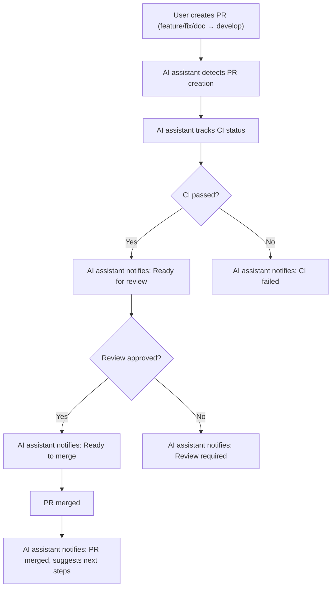

# Development progress Agent-Plugins-Platform

## Автоматизация: Отслеживание статуса Pull Request

В проекте реализован механизм автоматического отслеживания статуса всех текущих и будущих Pull Request (PR):
- AI-ассистент отслеживает создание, ревью, прохождение CI, merge и закрытие PR.
- При изменении статуса PR (новый комментарий, одобрение, CI, merge) пользователь получает уведомление прямо в чате.
- Механизм работает для всех веток и PR, оформленных по workflow (feature/fix/doc → PR → develop → PR → main).
- Это ускоряет ревью, снижает риск блокировок и повышает прозрачность процесса.
- Статус PR можно запросить вручную или получать автоматически.

**Визуализация процесса:**

**Пример сценария:**
1. Пользователь создает PR из ветки feature/sidepanel-e2e в develop.
2. AI-ассистент уведомляет о создании PR и отслеживает прохождение CI.
3. После успешного CI и ревью AI-ассистент сообщает о готовности к merge.
4. После merge — уведомление о завершении и рекомендации по следующему этапу.

**Кросс-ссылки:**
- [Best Practices: Automated PR Status Tracking](../docs/for-ai-best-practices/development-principles.md#automated-pr-status-tracking)
- [Workflow & Branch Protection](../docs/for-ai-best-practices/development-principles.md#workflow--branch-protection)

---

## Автоматизация: Проверка Pull Request через danger.js

- В проекте внедрён danger.js, который автоматически проверяет каждый PR в CI:
  - Наличие подробного описания PR
  - Обновление changelog при изменениях в исходном коде
  - Наличие кросс-ссылок на правила, best practices или документацию
  - Обновление документации при изменениях в src/core
- Все замечания и предупреждения появляются прямо в обсуждении PR на GitHub.
- Это полностью снимает рутинный контроль с AI и команды, повышает прозрачность и качество ревью.

**Кросс-ссылки:**
- [Best Practices: Automated PR Checks](../docs/for-ai-best-practices/ci-integration.md)
- [.github/workflows/danger.yml]
- [danger/dangerfile.js]

---

## Автоматизация: Релизы и версионирование через semantic-release

- В проекте внедрён semantic-release для полной автоматизации релизов:
  - Автоматически анализирует conventional commits и определяет тип релиза (major/minor/patch)
  - Обновляет CHANGELOG.md и package.json во всех пакетах
  - Создаёт git-теги и публикует релизы на GitHub/npm (при наличии токенов)
  - Запускается автоматически при merge в main через GitHub Actions
- Это полностью убирает ручное управление версиями и changelog, снижает риск ошибок и ускоряет публикацию.

**Кросс-ссылки:**
- [Best Practices: CI/CD Integration](../docs/for-ai-best-practices/ci-integration.md)
- [.releaserc.json]
- [.github/workflows/release.yml]

---

## Автоматизация: Обновление зависимостей через Renovate

- В проекте настроен Renovate для автоматического обновления npm/pnpm-зависимостей:
  - Создаёт PR с обновлениями пакетов, сгруппированными по типу (например, types/pnpm)
  - Все обновления проходят через CI, danger.js и стандартный workflow
  - PR помечаются лейблами dependencies, renovate
  - Лимиты на частоту и количество PR выставлены для удобства ревью
  - Автоматическое слияние отключено (можно включить по желанию)
- Это снимает рутину с AI и команды, снижает риск уязвимостей и устаревших пакетов.

**Кросс-ссылки:**
- [Best Practices: CI/CD Integration](../docs/for-ai-best-practices/ci-integration.md)
- [renovate.json]

---

## Автоматизация: Аудит безопасности зависимостей

- В проекте настроен автоматический аудит зависимостей через pnpm audit:
  - На каждый push и PR в main/develop запускается аудит в GitHub Actions
  - Все найденные уязвимости (начиная с moderate) отображаются прямо в CI
  - Это позволяет быстро реагировать на критические проблемы и снижает риск попадания уязвимостей в production
- Механизм полностью автоматизирован и не требует ручного контроля со стороны AI или команды.

**Кросс-ссылки:**
- [Best Practices: CI/CD Integration](../docs/for-ai-best-practices/ci-integration.md)
- [.github/workflows/audit.yml]

---

## Правило: Отслеживание смысла ветки и завершение задач

Перед началом новой задачи, не связанной с целью текущей ветки:
- Необходимо завершить работу в текущей ветке: закоммитить все изменения, запушить ветку, оформить Pull Request и дождаться merge.
- Только после merge текущей ветки разрешается создавать новую ветку для следующей задачи.
- Это предотвращает смешивание задач, повышает прозрачность истории и облегчает ревью.
- Исключения допускаются только для срочных багфиксов (fix/), которые оформляются отдельной веткой.

**Автоматическая защита:**
- В проекте реализован pre-commit и pre-push hook (bash-scripts/prevent-branch-mixing.sh), который блокирует коммиты и пуши, если тип задачи в коммит-месседже не совпадает с типом ветки (feature/, fix/, chore/, docs/, refactor/).
- Если обнаружено смешивание задач — коммит/пуш блокируется с пояснением.
- Это правило зафиксировано в .cursor/rules, best practices и AI-memory-bank.

**Кросс-ссылки:**
- [Best Practices: Branch Purpose Tracking](../docs/for-ai-best-practices/development-principles.md#branch-purpose-tracking)
- [.cursor/rules/workflow/branches.mdc]

## Завершенные этапы

### ✅ Этап 1: Базовая архитектура (Завершен)
- [x] Создание структуры проекта
- [x] Настройка сборки и инструментов разработки
- [x] Базовая интеграция Pyodide
- [x] MCP протокол для JS-Python коммуникации
- [x] Система плагинов с манифестами

### ✅ Этап 2: UI компоненты (Завершен)
- [x] Side Panel для управления плагинами
- [x] Popup интерфейс
- [x] Options страница настроек
- [x] DevTools панель
- [x] New Tab страница
- [x] Content scripts для инъекции

### ✅ Этап 3: Система чатов плагинов (Завершен)
- [x] Архитектура чатов per-page, per-plugin
- [x] LRU кэширование в памяти
- [x] Персистентность через IndexedDB
- [x] Real-time синхронизация между вкладками
- [x] UI компоненты для чатов
- [x] Административная панель для управления чатами
- [x] API для экспорта и очистки чатов

### ✅ Этап 4: Исправление критических ошибок (Завершен)
- [x] Исправление "Service worker registration failed. Status code: 15"
- [x] Добавление зависимости idb для IndexedDB
- [x] Исправление конфигурации Vite
- [x] Устранение всех ESLint ошибок
- [x] Улучшение доступности UI компонентов

### ✅ Этап 5: Архитектурная документация (Завершен)
- [x] Комплексная архитектура системы
- [x] Карта связей файлов
- [x] Документация по безопасности
- [x] Руководства по разработке
- [x] Интеграция с Cursor IDE

### ✅ Этап 6: Ленивая синхронизация чатов (Завершен - 2025-07-12)
- [x] Система черновиков сообщений с IndexedDB v2
- [x] Debounce для автоматического сохранения (1 секунда задержка)
- [x] Пороговые значения длины для синхронизации (10-1000 символов)
- [x] Ленивая инициализация чатов при начале ввода
- [x] Хук useLazyChatSync для React компонентов
- [x] Компонент DraftStatus с анимациями и визуальными состояниями
- [x] Обновленная DevTools панель с управлением черновиками
- [x] Автоматическая очистка черновиков после отправки сообщения
- [x] Индикаторы статуса синхронизации (загрузка, сохранение, ошибка)
- [x] Документация архитектуры системы (lazy-chat-sync.md)
- [x] Исправление ошибок линтера и доступности
- [x] Коммит: feat(chat): внедрение ленивой синхронизации и черновиков
- [x] Исправление контекста чатов - привязка к активной вкладке
- [x] Коммит: fix(chat): исправление контекста чатов - привязка к активной вкладке

### ✅ Этап 7: Исправление DevTools Panel (Завершен - 2025-07-12)
- [x] Диагностика проблемы отсутствия DevTools panel
- [x] Выявление неправильной конфигурации devtools_page в манифесте
- [x] Исправление пути с devtools-panel/index.html на devtools/index.html
- [x] Обновление названия панели на "Agent Platform Tools"
- [x] Создание comprehensive troubleshooting guide
- [x] Обновление usage guide с инструкциями
- [x] Создание кладбища ошибок (errors.md)
- [x] Коммит: fix: resolve DevTools panel issue - correct devtools_page path in manifest

### ✅ Этап 8: Система тестирования чатов и логов (Завершен - 2025-01-12)
- [x] Создание CSP-совместимой системы загрузки тестовых скриптов
- [x] Реализация TestLoader с предотвращением дублирования
- [x] Создание тестов для ozon-analyzer и test-chat-plugin
- [x] Интеграция тестов в DevTools панель "Agent Platform Tools"
- [x] Решение проблем с Content Security Policy (eval() блокируется)
- [x] Исправление ошибок получения URL в DevTools контексте
- [x] Полное тестирование системы чатов, сообщений, черновиков и логов
- [x] Создание comprehensive testing guide и документации
- [x] Валидация производительности: тесты выполняются за 2-3 секунды
- [x] Документирование результатов тестирования и рекомендаций
- [x] Обновление кладбища ошибок с решенными проблемами

### 🏆 Этап: Устойчивый обмен данными между SidePanel и Background (Manifest V3)
- [x] Диагностика и устранение ошибки "The message port closed before a response was received" при обмене между сайдпанелью и background
- [x] Перевод обмена на Port API (chrome.runtime.connect/onConnect)
- [x] Реализация устойчивого соединения с автоматическим переподключением
- [x] Обработка ошибок и таймаутов для стабильности
- [x] Оптимизация производительности обмена данными
- [x] Создание comprehensive troubleshooting guide
- [x] Документирование архитектуры Port API
- [x] Обновление кладбища ошибок с решенными проблемами
- [x] Коммит: feat: implement stable Port API communication between SidePanel and Background

### ✅ Этап 9: Полная интернационализация и система синхронизации команд (Завершен - 2024-07-19)
- [x] Полный перевод .cursor и memory-bank на английский язык
- [x] Создание системы автоматической синхронизации команд
- [x] Универсальный формат команд (английский + русский)
- [x] Интеграция с Cursor AI memory-bank
- [x] Создание скрипта `.cursor/rules/command-sync.cjs`
- [x] Автоматическая генерация всех файлов команд
- [x] Экспорт команд для Cursor AI memory-bank
- [x] Документация системы синхронизации
- [x] Готовность к международному сообществу
- [x] Совместимость с любым AI-ассистентом
- [x] Коммит: feat: complete translation of .cursor and memory-bank to English for international AI/LLM compatibility
- [x] Коммит: feat: implement command synchronization system between USER_COMMANDS.md, ai-memory.mdc, and Cursor AI memory-bank

## Текущий этап

### 🔄 Этап 10: Готовность к международному сообществу (В процессе)
- [ ] Тестирование системы синхронизации команд
- [ ] Интеграция команд в Cursor AI memory-bank
- [ ] Публикация .cursor для международного сообщества
- [ ] Сбор обратной связи от глобального сообщества
- [ ] Дальнейшая оптимизация на основе обратной связи

## Планы на будущее

### Краткосрочные цели (1-2 недели)
- Тестирование системы синхронизации команд
- Интеграция команд в Cursor AI memory-bank
- Публикация .cursor для международного сообщества
- Сбор обратной связи от глобального сообщества

### Среднесрочные цели (1 месяц)
- Расширение системы команд новыми категориями
- API интеграция с Cursor для автоматических обновлений
- Создание шаблонов команд для разных типов проектов
- Развитие экосистемы плагинов

### Долгосрочные цели (3 месяца)
- Создание полноценной международной платформы
- Развитие глобального сообщества разработчиков
- Интеграция с популярными сервисами
- Многоязычная поддержка интерфейса