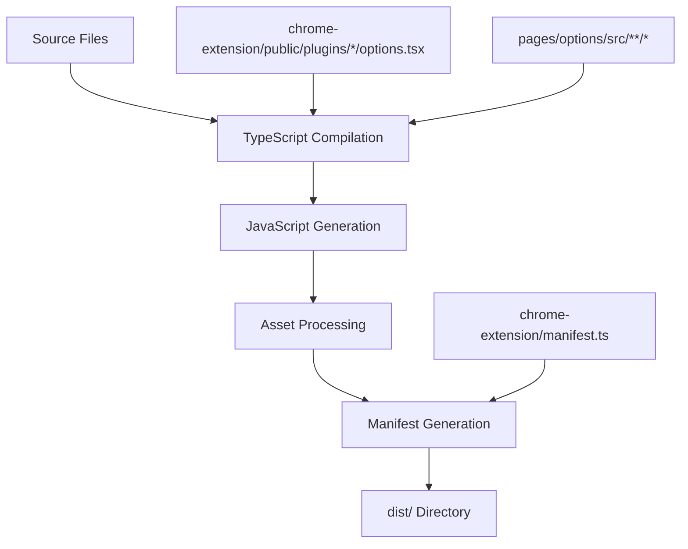

# Build Sources Mapping - Соответствие исходных файлов результатам компиляции

## Связанные документы

- **[Правила компиляции](../vite.config.mts)** - Конфигурация Vite bundler (минификация, sourcemaps)
- **[Настройки TypeScript](../tsconfig.json)** - Конфигурация компилятора TypeScript (target ESNext, JSX, пути)

## Обзор

Этот документ описывает соответствие между исходными файлами в проекте и файлами, генерируемыми в процессе сборки. Важно понимать эти связи для корректного внесения изменений в конфигурацию расширения.

## Основные соответствия файлов

### Manifest расширения

**Цепочка компиляции:**
1. `chrome-extension/manifest.ts` - исходный файл (TypeScript определение)
2. `chrome-extension/manifest.cjs` - компилируется через `tsc -b pre-build.tsconfig.json` ([известная проблема с компиляцией](#известные-проблемы))
3. `dist/manifest.json` - генерируется через `make-manifest-plugin` из manifest.cjs

**Источник:** `chrome-extension/manifest.ts`
```typescript
// TypeScript определение манифеста
export default {
  manifest_version: 3,
  // ... все настройки расширения
  content_security_policy: {
    extension_pages: "script-src 'self' 'wasm-unsafe-eval' 'unsafe-eval'; object-src 'self'"
  }
}
```

**Промежуточный результат:** `chrome-extension/manifest.cjs`
```javascript
// Скомпилированный CommonJS модуль
exports.default = {
  manifest_version: 3,
  content_security_policy: {
    extension_pages: "script-src 'self' 'wasm-unsafe-eval' 'unsafe-eval'; object-src 'self'"
  }
}
```

**Финальный результат:** `dist/manifest.json`
```json
{
  "manifest_version": 3,
  "content_security_policy": {
    "extension_pages": "script-src 'self' 'wasm-unsafe-eval' 'unsafe-eval'; object-src 'self'"
  }
}
```

**Важно:**
- Все изменения в CSP (Content Security Policy) нужно вносить **ТОЛЬКО** в `chrome-extension/manifest.ts`
- Запускать `pnpm ready` в папке chrome-extension для обновления manifest.cjs
- Пересобирать проект для применения изменений в dist/manifest.json
- **НЕ редактировать:** `dist/manifest.json` или `chrome-extension/public/manifest.json` - они перезаписываются

**Известные проблемы:**
- **Компиляция manifest.cjs:** TypeScript компилятор может не обновлять manifest.cjs из-за кэширования или проблем с Node.js модулями. В этом случае вручную отредактировать `chrome-extension/manifest.cjs`, добавив необходимые изменения в CSP.
- **Кэширование:** После изменений в manifest.ts удалить `pre-build.tsconfig.tsbuildinfo` для принудительной перекомпиляции.

### Настройки плагинов

**Источник:** `chrome-extension/public/plugins/{pluginId}/options.tsx`
```typescript
// React компонент настроек плагина
export default function OzonAnalyzerOptions({ ... }) {
  return <div className="ozon-analyzer-options">...</div>;
}
```

**Результат:** `chrome-extension/public/plugins/{pluginId}/options.js`
```javascript
// Скомпилированный JavaScript с React компонентом
(function(React, useState, useEffect, ToggleButton, useTranslations, chrome) {
  'use strict';
  // Компилированный код компонента
  return { OzonAnalyzerOptions };
})
```

**Процесс компиляции:** TypeScript → JavaScript с поддержкой React и зависимостей платформы.

### Основные исходные файлы

#### Frontend (Options, Side Panel)

| Исходный файл | Результат сборки | Описание |
|---------------|------------------|----------|
| `pages/options/src/**/*` | `dist/options/**/*` | Страница настроек расширения |
| `pages/side-panel/src/**/*` | `dist/side-panel/**/*` | Боковая панель |
| `chrome-extension/src/**/*` | `dist/background/**/*` | Background скрипты |
| `chrome-extension/public/**/*` | `dist/**/*` | Статические ресурсы |

#### Backend (MCP Servers)

| Исходный файл | Результат сборки | Описание |
|---------------|------------------|----------|
| `chrome-extension/public/plugins/*/mcp_server.py` | Без изменений | Python скрипты копируются как есть |
| `chrome-extension/public/plugins/*/manifest.json` | Без изменений | Конфигурация плагинов копируется как есть |

### Процесс сборки



### Важные замечания

#### 1. Manifest Configuration
- **НЕ редактировать:** `dist/manifest.json` - генерируется автоматически
- **НЕ редактировать:** `chrome-extension/public/manifest.json` - статический файл для разработки
- **ТОЛЬКО редактировать:** `chrome-extension/manifest.ts` - источник истины для манифеста

#### 2. Plugin Options
- **Исходник:** `options.tsx` - React компонент с полным TypeScript
- **Результат:** `options.js` - скомпилированный JavaScript для динамической загрузки
- **Зависимости:** Передаются через замыкание в момент выполнения

#### 3. Development vs Production
- **Development:** Файлы могут читаться напрямую из `public/`
- **Production:** Все файлы проходят через bundler и оптимизацию

### Недавние изменения

#### Исправление CSP для плагинов (2025-10-03)
- **Проблема:** Отсутствие `'unsafe-eval'` блокировало динамическую загрузку компонентов плагинов
- **Решение:** Добавлен `'unsafe-eval'` в `manifest.ts`
- **Результат:** Динамическая загрузка TSX компонентов работает корректно

### Диагностика проблем сборки

#### Проблема: Настройки плагина не загружаются
```
Ошибка: "script-src 'self' 'wasm-unsafe-eval'"
```
**Решение:** Проверить `'unsafe-eval'` в `chrome-extension/manifest.ts` и пересобрать проект.

#### Проблема: Изменения в manifest.json не применяются
**Причина:** Файл `dist/manifest.json` перезаписывается сборкой из `manifest.ts`
**Решение:** Вносить изменения только в `chrome-extension/manifest.ts`

---

**Создано:** 2025-10-03
**Обновлено:** 2025-10-03
**Ответственный:** Build Team, DevOps
**Статус:** Активно используется