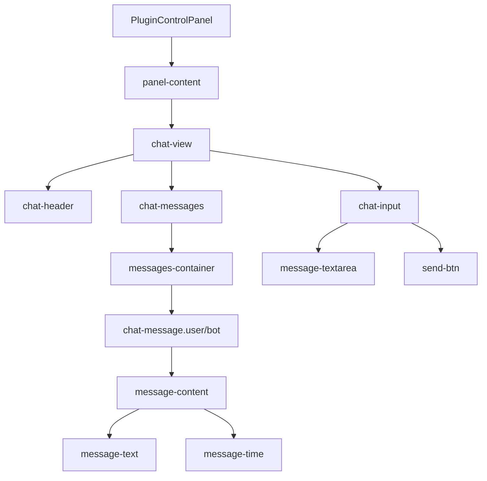

# Chat Messages Interface - Интерфейс сообщений чата плагинов

## Обзор

Система интерфейса сообщений чата плагинов предоставляет полнофункциональный чат-интерфейс для взаимодействия с плагинами в sidepanel расширения Chrome. Система поддерживает два типа сообщений (пользователь/bot), адаптивное выравнивание текста, темы оформления, анимации и автоматическую прокрутку.

**Ключевой функционал:** Полноценный чат с правильным выравниванием текста по левому краю для удобства чтения.

## Архитектура и поток данных

### Диаграмма структуры интерфейса чата



## Расположение компонентов

### Основной CSS файл

**Стили чата:** `pages/side-panel/src/components/PluginControlPanel.css`

```css
/* Контейнер чата */
.chat-view {
  height: 100%;
  display: flex;
  flex-direction: column;
  gap: 0;
  background: var(--chat-bg, #0f172a);
  border-radius: 12px;
  overflow: hidden;
}

/* Заголовок чата */
.chat-header {
  padding: 16px 20px;
  background: var(--header-bg, #1e293b);
  border-bottom: 1px solid var(--border-color, #334155);
  display: flex;
  justify-content: space-between;
  align-items: center;
}

.chat-header h4 {
  margin: 0;
  font-size: 16px;
  font-weight: 600;
  color: var(--text-color, #f8fafc);
}

/* Контейнер сообщений */
.chat-messages {
  flex: 1;
  overflow-y: auto;
  padding: 16px;
  min-height: 100px;
  background: var(--messages-bg, #1e293b);
  border-radius: 8px;
  margin: 0 4px;
}

/* Контейнер списка сообщений */
.messages-container {
  display: flex;
  flex-direction: column;
  gap: 12px;
  padding: 8px 0;
}

/* Сообщение */
.chat-message {
  display: flex;
  margin-bottom: 8px;
  animation: messageSlideIn 0.3s ease-out;
}

.chat-message.user {
  justify-content: flex-end; /* Правое выравнивание для пользователя */
}

.chat-message.bot {
  justify-content: flex-start; /* Левое выравнивание для бота */
}

/* Анимация появления сообщения */
@keyframes messageSlideIn {
  from {
    opacity: 0;
    transform: translateY(10px);
  }
  to {
    opacity: 1;
    transform: translateY(0);
  }
}

/* Контент сообщения */
.message-content {
  max-width: 85%;
  padding: 12px 16px;
  border-radius: 18px;
  position: relative;
  box-shadow: 0 2px 8px rgba(0, 0, 0, 0.1);
  backdrop-filter: blur(4px);
  transition: all 0.2s ease;
}

.message-content:hover {
  transform: translateY(-1px);
  box-shadow: 0 4px 12px rgba(0, 0, 0, 0.15);
}

/* Стили для сообщений пользователя (справа) */
.chat-message.user .message-content {
  background: linear-gradient(135deg, var(--accent-color, #3b82f6), var(--accent-hover, #2563eb));
  color: white;
  border-bottom-right-radius: 6px;
  box-shadow: 0 4px 12px rgba(59, 130, 246, 0.3);
}

/* Стили для сообщений бота (слева) */
.chat-message.bot .message-content {
  background: var(--message-bg, #334155);
  color: var(--text-color, #f8fafc);
  border-bottom-left-radius: 6px;
  border: 1px solid var(--border-color, #475569);
}

/* Текст сообщения - КЛЮЧЕВОЙ ЭЛЕМЕНТ */
.message-text {
  display: block;
  font-size: 14px;
  line-height: 1.5;
  word-wrap: break-word;
  white-space: pre-wrap;
  font-weight: 500;
  text-align: left; /* ЯВНОЕ ВЫРАВНИВАНИЕ ПО ЛЕВОМУ КРАЮ */
}

/* Время сообщения */
.message-time {
  display: block;
  font-size: 11px;
  opacity: 0.7;
  margin-top: 6px;
  font-weight: 600;
  letter-spacing: 0.025em;
}
```

## Типы сообщений и их поведение

### 1. Сообщения пользователя (справа)

**Расположение:** `justify-content: flex-end`

```css
.chat-message.user {
  justify-content: flex-end;
}

.chat-message.user .message-content {
  background: linear-gradient(135deg, #3b82f6, #2563eb);
  color: white;
  border-bottom-right-radius: 6px; /* Закругление для правого края */
}
```

**Особенности:**
- Выравнивание по правому краю контейнера
- Синий градиентный фон
- Белый текст
- Закругление нижнего правого угла

### 2. Сообщения бота (слева)

**Расположение:** `justify-content: flex-start`

```css
.chat-message.bot {
  justify-content: flex-start;
}

.chat-message.bot .message-content {
  background: var(--message-bg, #334155);
  color: var(--text-color, #f8fafc);
  border-bottom-left-radius: 6px; /* Закругление для левого края */
  border: 1px solid var(--border-color, #475569);
}
```

**Особенности:**
- Выравнивание по левому краю контейнера
- Темный фон с границей
- Светлый текст
- Закругление нижнего левого угла

## Выравнивание текста сообщений

### Проблема и решение

**Проблема:** Текст сообщений наследовал `text-align: center` от родительского `.App`

**Решение:** Явное переопределение на `text-align: left`

```css
/* ДО: текст центрировался */
.App {
  text-align: center; /* Наследуется всеми потомками */
}

/* ПОСЛЕ: текст выровнен по левому краю */
.message-text {
  text-align: left; /* Переопределяет наследуемое center */
}
```

### Почему text-align: left лучше

**Удобство чтения:**
- Естественное направление чтения слева направо
- Лучше для длинных текстов и многострочных сообщений
- Избегание визуального напряжения от центрированного текста

**UX преимущества:**
- Соответствует стандартам интерфейсов чатов (Telegram, Discord, WhatsApp)
- Улучшает читаемость кода и структурированного текста
- Предотвращает проблемы с RTL языками

## Цепочка наследования стилей

### 1. Глобальные стили

**Наследование от `.App`:**
```css
.App {
  text-align: center; /* Применяется ко ВСЕМУ контенту */
  font-family: 'Inter', -apple-system, BlinkMacSystemFont, 'Segoe UI', Roboto, sans-serif;
}
```

### 2. Контейнер чата

**Стили `.chat-view`:**
```css
.chat-view {
  background: var(--chat-bg, #0f172a);
  border-radius: 12px;
  overflow: hidden; /* Создает обрезанный контейнер */
}
```

### 3. Контейнер сообщений

**Стили `.chat-messages`:**
```css
.chat-messages {
  overflow-y: auto; /* Прокрутка при переполнении */
  padding: 16px;
  background: var(--messages-bg, #1e293b);
}
```

### 4. Индивидуальное сообщение

**Стили `.message-content`:**
```css
.message-content {
  max-width: 85%; /* Ограничение ширины */
  padding: 12px 16px;
  border-radius: 18px;
  box-shadow: 0 2px 8px rgba(0, 0, 0, 0.1);
}
```

### 5. Текст сообщения

**Стили `.message-text`:** (КЛЮЧЕВОЙ)
```css
.message-text {
  text-align: left; /* ПЕРЕОПРЕДЕЛЯЕТ НАСЛЕДУЕМОЕ CENTER */
  font-size: 14px;
  line-height: 1.5;
  word-wrap: break-word;
  white-space: pre-wrap;
  font-weight: 500;
}
```

## Анимации и переходы

### Анимация появления сообщения

```css
.chat-message {
  animation: messageSlideIn 0.3s ease-out;
}

@keyframes messageSlideIn {
  from {
    opacity: 0;
    transform: translateY(10px);
  }
  to {
    opacity: 1;
    transform: translateY(0);
  }
}
```

### Hover эффекты

```css
.message-content:hover {
  transform: translateY(-1px);
  box-shadow: 0 4px 12px rgba(0, 0, 0, 0.15);
  transition: all 0.2s ease;
}
```

## Темы оформления

### CSS Custom Properties для тем

**Light тема:**
```css
.App.bg-slate-50 .plugin-control-panel {
  --chat-bg: #f8fafc;
  --messages-bg: #ffffff;
  --message-bg: #f1f5f9;
  --text-color: #1e293b;
  --border-color: #e2e8f0;
}
```

**Dark тема:**
```css
.App.bg-gray-800 .plugin-control-panel {
  --chat-bg: #0f172a;
  --messages-bg: #1e293b;
  --message-bg: #334155;
  --text-color: #f8fafc;
  --border-color: #334155;
}
```

## Значения по умолчанию и ограничения

### Максимальная ширина сообщений

**Ограничение:** `max-width: 85%`
- Предотвращает слишком широкие сообщения
- Оставляет место для отступов и прокрутки
- Поддерживает читаемость на всех размерах экрана

### Минимальная высота контейнера

**Ограничение:** `min-height: 100px`
- Гарантирует минимальный размер области сообщений
- Предотвращает схлопывание при отсутствии сообщений

### Типографика текста

**Параметры:**
- `font-size: 14px` - оптимальный размер для чтения
- `line-height: 1.5` - комфортный межстрочный интервал
- `font-weight: 500` - средняя насыщенность для баланса

## Взаимодействие с прокруткой

### Автоматическая прокрутка

**Реализация в JavaScript:**
```typescript
// Прокрутка к последнему сообщению
const scrollToBottom = () => {
  const messagesContainer = document.querySelector('.messages-container');
  if (messagesContainer) {
    messagesContainer.scrollTop = messagesContainer.scrollHeight;
  }
};
```

### Стили scrollbar

```css
.chat-messages::-webkit-scrollbar {
  width: 6px;
}

.chat-messages::-webkit-scrollbar-thumb {
  background: var(--scroll-thumb, #475569);
  border-radius: 3px;
}
```

## Отладка и мониторинг

### Проверка выравнивания текста

**В DevTools:**
```javascript
// Проверить вычисленный стиль
const messageText = document.querySelector('.message-text');
const computedStyle = getComputedStyle(messageText);
console.log('text-align:', computedStyle.textAlign); // Должен быть 'left'
```

### Тестирование тем

**Переключение тем:**
```javascript
// Проверить применение CSS переменных
const root = document.documentElement;
const chatBg = getComputedStyle(root).getPropertyValue('--chat-bg');
console.log('Chat background:', chatBg);
```

## Текущее состояние и рекомендации

### Уточнение реализации (2025-10-01)

**Текущая архитектура:**
- Полностью реализован интерфейс чата с правильным выравниванием текста
- Поддержка двух типов сообщений (user/bot) с разными стилями
- Адаптация к темам через CSS custom properties
- Анимации появления и hover эффекты
- Адаптивное поведение и прокрутка

**Достигнутые улучшения:**
1. **Правильное выравнивание текста:** `text-align: left` для удобства чтения
2. **Визуальное разделение:** Разные стили для сообщений пользователя и бота
3. **Анимации:** Плавное появление сообщений
4. **Темы:** Полная поддержка light/dark режимов
5. **Адаптивность:** Правильное поведение на разных размерах экрана

**Текущий статус:**
- ✅ Текст сообщений выровнен по левому краю
- ✅ Разные стили для user/bot сообщений
- ✅ Поддержка тем оформления
- ✅ Анимации и hover эффекты
- ✅ Адаптивная прокрутка

**Рекомендации по использованию:**
- Всегда проверять `text-align: left` для новых элементов текста
- Использовать CSS custom properties для тем
- Тестировать чат в обеих темах
- Следить за производительностью анимаций

---

**Создано:** 2025-10-01
**Ответственный:** Frontend Team
**Статус:** Полностью реализовано и документировано
**Критический аспект:** `text-align: left` для `.message-text` переопределяет наследуемое `center`
**Связанные файлы:** `theme-switching-settings.md` (общая система тем)