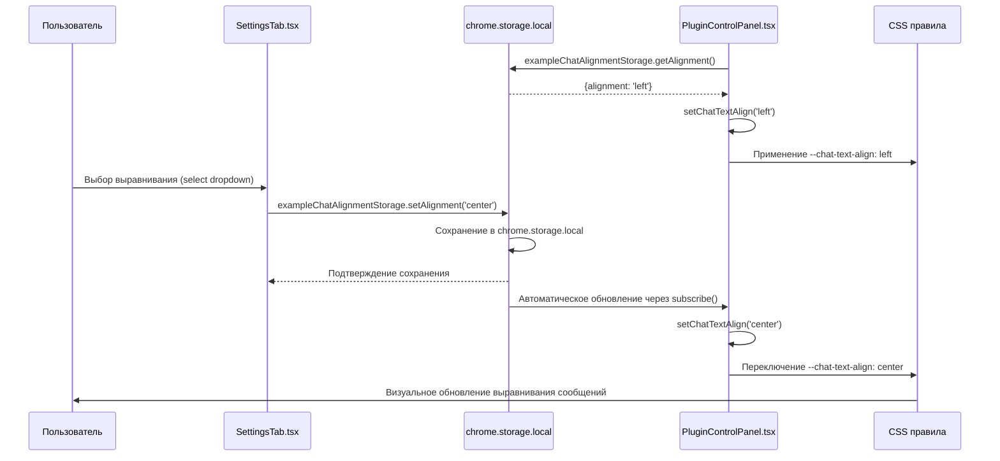

# Chat Text Alignment Settings - Настройки выравнивания текста чата

## Обзор

Система настройки выравнивания текста чата позволяет пользователям выбирать между тремя режимами выравнивания сообщений в чате плагинов: 'left' (по левому краю), 'center' (по центру) и 'right' (по правому краю). Настройка применяется ко всем сообщениям в плагин-контроллере sidepanel и сохраняется в настройках расширения.

## Архитектура и поток данных

### Диаграмма последовательности настройки выравнивания текста чата



## Расположение настроек

### Frontend (Пользовательский интерфейс)

**Компонент настроек:** `pages/options/src/components/SettingsTab.tsx`

```typescript
// Состояние для настройки chatAlignment
const [chatAlignment, setChatAlignment] = React.useState<ChatAlignment>('left');

// useEffect для загрузки и подписки на изменения chatAlignment
React.useEffect(() => {
  const loadAlignment = async () => {
    const alignment = await exampleChatAlignmentStorage.getAlignment();
    setChatAlignment(alignment);
  };

  loadAlignment();

  const unsubscribe = exampleChatAlignmentStorage.subscribe(() => {
    loadAlignment();
  });

  return unsubscribe;
}, []);

// Рендер select элемента
<div className="setting-item">
  <label>Chat text alignment:
    <select
      value={chatAlignment}
      onChange={(e) => {
        const newAlignment = e.target.value as ChatAlignment;
        setChatTextAlign(newAlignment);
        exampleChatAlignmentStorage.setAlignment(newAlignment);
      }}
    >
      <option value="left">Left</option>
      <option value="center">Center</option>
      <option value="right">Right</option>
    </select>
  </label>
</div>
```

**Компонент плагин-контроллера:** `pages/side-panel/src/components/PluginControlPanel.tsx`

```typescript
// Состояние и загрузка настройки выравнивания
const [chatTextAlign, setChatTextAlign] = useState<ChatAlignment>('left');

useEffect(() => {
  const loadAlignment = async () => {
    const alignment = await exampleChatAlignmentStorage.getAlignment();
    setChatTextAlign(alignment);
  };

  loadAlignment();

  const unsubscribe = exampleChatAlignmentStorage.subscribe(() => {
    loadAlignment();
  });

  return unsubscribe;
}, []);

// Применение CSS переменной к корневому элементу
return (
  <div className="plugin-control-panel" style={{ '--chat-text-align': chatTextAlign }}>
    {/* ... остальной JSX */}
  </div>
);
```

### Storage Layer (Хранилище настроек)

**Хранилище выравнивания чата:** `packages/storage/lib/impl/example-chat-alignment-storage.ts`

```typescript
import { createStorage, StorageEnum } from '../base/index.js';
import type { ChatAlignmentStateType, ChatAlignmentStorageType, ChatAlignment } from '../base/index.js';

const storage = createStorage<ChatAlignmentStateType>(
  'chat-alignment-storage-key',
  {
    alignment: 'left', // Значение по умолчанию
  },
  {
    storageEnum: StorageEnum.Local,
    liveUpdate: true, // Включает автоматические обновления подписчиков
  },
);

export const exampleChatAlignmentStorage: ChatAlignmentStorageType = {
  ...storage,
  setAlignment: async (alignment: ChatAlignment) => {
    await storage.set({ alignment });
  },
  getAlignment: async () => {
    const state = await storage.get();
    return state.alignment;
  },
};
```

## Цепь использования настройки

### 1. Инициализация

**При первом запуске расширения:**
1. `exampleChatAlignmentStorage` создается с начальным значением: `{alignment: 'left'}`
2. Настройка сохраняется в `chrome.storage.local` под ключом `'chat-alignment-storage-key'`
3. Live update включен для автоматического уведомления подписчиков

**При открытии sidepanel:**
1. `PluginControlPanel` вызывает `exampleChatAlignmentStorage.getAlignment()` для загрузки сохраненной настройки
2. Подписывается на изменения через `exampleChatAlignmentStorage.subscribe()`
3. Устанавливает `chatTextAlign` состояние
4. Применяет CSS переменную `--chat-text-align` к корневому элементу

### 2. Изменение настройки

**При выборе новой настройки в SettingsTab:**
1. Пользователь выбирает значение в выпадающем списке (left/center/right)
2. Вызывается `exampleChatAlignmentStorage.setAlignment(newValue)`
3. Новое значение сохраняется в chrome.storage.local
4. Все подписчики автоматически уведомляются об изменениях через live update механизм

**Реактивное обновление интерфейса:**
1. `PluginControlPanel` получает обновление через subscribe callback
2. Обновляется состояние `chatTextAlign`
3. Пересчитывается CSS переменная `--chat-text-align`
4. CSS правило `text-align: var(--chat-text-align, left)` применяет новое выравнивание ко всем сообщениям

### 3. Работа с сообщениями чата

**Применение к сообщениям:**
- Все сообщения в чате (как от пользователя, так и от бота) используют CSS правило `.message-text`
- Выравнивание применяется через CSS переменную к каждому сообщению
- Не влияет на другие элементы интерфейса (время сообщения, статус и т.д.)

**Форматирование сообщений:**
- Сообщения пользователя: выравнивание применяется к тексту внутри `.chat-message.user .message-content`
- Сообщения бота: выравнивание применяется к тексту внутри `.chat-message.bot .message-content`

### 4. CSS правила выравнивания

**Основные правила:** `pages/side-panel/src/components/PluginControlPanel.css`

```css
.message-text {
  display: block;
  font-size: 14px;
  line-height: 1.5;
  word-wrap: break-word;
  white-space: pre-wrap;
  font-weight: 500;
  text-align: var(--chat-text-align, left); /* Применение CSS переменной */
}
```

**Наследование:**
- CSS переменная `--chat-text-align` устанавливается на корневом элементе `.plugin-control-panel`
- Все дочерние элементы с классом `.message-text` наследуют значение через `var(--chat-text-align, left)`
- Fallback на `left` обеспечивает работоспособность при отсутствии переменной

## Режимы выравнивания

### Left Mode (По левому краю)
- **Значение:** `'left'`
- **Применение:** Стандартное выравнивание для чтения слева направо
- **CSS значение:** `text-align: left`

### Center Mode (По центру)
- **Значение:** `'center'`
- **Применение:** Центрированное выравнивание для коротких сообщений или цитат
- **CSS значение:** `text-align: center`

### Right Mode (По правому краю)
- **Значение:** `'right'`
- **Применение:** Выравнивание по правому краю для специальных случаев
- **CSS значение:** `text-align: right`

## Значения по умолчанию

### Новые установки
- **alignment:** `'left'` (выравнивание по левому краю по умолчанию)
- Сохраняются в `chrome.storage.local` под ключом `'chat-alignment-storage-key'`

### Существующие установки
- Сохраняют свои настройки в `chrome.storage.local`
- При обновлении расширения настройки сохраняются

## Взаимодействие с другими системами

### Chrome Storage API
- **Хранилище:** `chrome.storage.local` с ключом `'chat-alignment-storage-key'`
- **Формат данных:**
  ```json
  {
    "chat-alignment-storage-key": {
      "alignment": "left"
    }
  }
  ```
- **Live updates:** Включены для синхронизации между вкладками

### React State Management
- **PluginControlPanel:** Локальное состояние `chatTextAlign`
- **SettingsTab:** Локальное состояние `chatAlignment`
- **Синхронизация:** Через storage subscribe callbacks

### CSS Custom Properties
- **Переменная для выравнивания:**
  ```css
  :root {
    --chat-text-align: left; /* Устанавливается динамически */
  }
  ```
- **Применение:** `text-align: var(--chat-text-align, left)`
- **Наследование:** Через DOM иерархию от `.plugin-control-panel`

## Детальная логика изменения

### Алгоритм установки выравнивания

```typescript
async function setChatAlignment(newAlignment: ChatAlignment) {
  // 1. Сохранение в storage
  await exampleChatAlignmentStorage.setAlignment(newAlignment);

  // 2. Автоматическое уведомление всех подписчиков
  // 3. Обновление состояния в компонентах
  // 4. Пересчет CSS переменных
  // 5. Перерендеринг с новым выравниванием
}
```

### Определение текущего выравнивания в компоненте

```typescript
// В PluginControlPanel
const currentAlignment = chatTextAlign; // 'left' | 'center' | 'right'
const cssVariable = { '--chat-text-align': currentAlignment };
```

### CSS селекторы для выравнивания

**Применение к сообщениям:**
```css
/* Все сообщения чата */
.message-text {
  text-align: var(--chat-text-align, left);
}

/* Сообщения пользователя */
.chat-message.user .message-text {
  text-align: var(--chat-text-align, left);
}

/* Сообщения бота */
.chat-message.bot .message-text {
  text-align: var(--chat-text-align, left);
}
```

**Наследование от корневого элемента:**
- Переменная устанавливается на `.plugin-control-panel`
- Наследуется всеми дочерними `.message-text` элементами
- Обновляется при изменении состояния `chatTextAlign`

## Отладка и мониторинг

### Логи в консоли

**SettingsTab:**
```javascript
console.log('[SettingsTab] Chat alignment changed:', { oldValue, newValue });
```

**PluginControlPanel:**
```javascript
console.log('[PluginControlPanel] Chat alignment loaded:', alignment);
console.log('[PluginControlPanel] CSS variable applied:', { '--chat-text-align': alignment });
```

**Storage operations:**
```javascript
console.log('[exampleChatAlignmentStorage] Setting alignment:', alignment);
console.log('[exampleChatAlignmentStorage] Notifying subscribers');
```

### Chrome DevTools

**Проверка storage:**
```javascript
chrome.storage.local.get('chat-alignment-storage-key').then(result => console.log(result));
```

**Проверка CSS переменных:**
- Inspect элемент `.plugin-control-panel`
- Проверить в разделе Computed → CSS Variables
- Убедиться что `--chat-text-align` имеет правильное значение

**Проверка визуального выравнивания:**
- Проверить CSS свойство `text-align` на элементах `.message-text`
- Убедиться что сообщения выравниваются согласно выбранной настройке

### Распространенные проблемы

**Выравнивание не применяется:**
1. Проверить CSS правило `.message-text { text-align: var(--chat-text-align, left); }`
2. Убедиться что CSS переменная `--chat-text-align` установлена на `.plugin-control-panel`
3. Проверить что `chatTextAlign` состояние обновляется

**Storage не сохраняется:**
1. Проверить разрешения `chrome.storage` в manifest.json
2. Проверить логи в background script
3. Убедиться что `liveUpdate: true` в конфигурации storage

**Настройка не синхронизируется:**
1. Проверить работу subscribe callback в PluginControlPanel
2. Убедиться что SettingsTab вызывает `setAlignment()` правильно
3. Проверить логи live update уведомлений

## Текущее состояние и известные проблемы

### Уточнение реализации (2025-10-01)

**Текущая архитектура:**
- Полностью реализована поддержка трех режимов выравнивания текста чата
- Синхронизация между настройками и sidepanel через shared storage
- CSS-first подход с динамическими переменными
- Live updates для мгновенного применения изменений

**Достигнутые улучшения:**
1. **Единая система хранения:** `exampleChatAlignmentStorage` с live updates
2. **Консистентный UI:** Select dropdown в настройках с тремя опциями
3. **Полная поддержка CSS:** Все сообщения чата адаптированы для динамического выравнивания
4. **Реактивные обновления:** Изменения применяются мгновенно без перезагрузки
5. **CSS переменные:** Гибкая система без хардкодированных значений

**Текущий статус:**
- ✅ Left alignment работает корректно
- ✅ Center alignment работает корректно
- ✅ Right alignment работает корректно
- ✅ Синхронизация между страницами работает
- ✅ Все сообщения чата (user/bot) адаптированы
- ✅ Сохранение в storage работает
- ✅ Live updates работают

---

**Создано:** 2025-10-01
**Ответственный:** Frontend Team
**Статус:** Полностью реализовано и протестировано