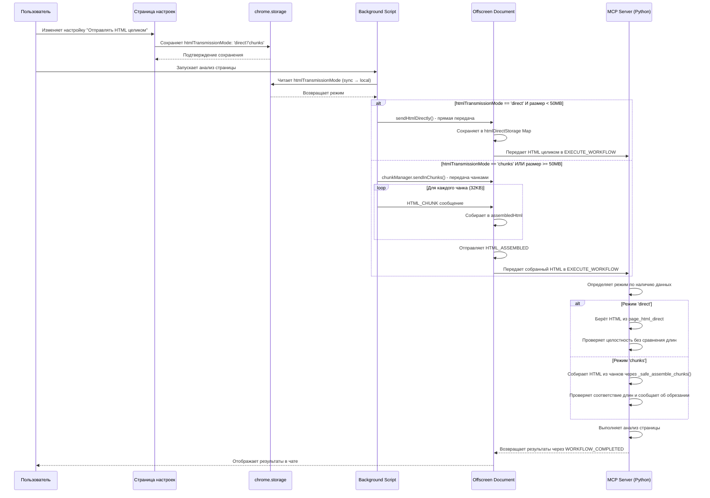

# HTML Transmission Settings - Настройки передачи HTML

## Обзор

Настройка "Отправлять HTML целиком" определяет режим передачи HTML-контента страниц в систему плагинов. Это критически важная настройка, влияющая на производительность, стабильность и надежность обработки больших HTML-документов.

## Архитектура и поток данных

### Диаграмма последовательности передачи HTML



## Расположение настроек

### Frontend (Пользовательский интерфейс)

**Основной файл настроек:** `pages/options/src/components/SettingsTab.tsx`

```typescript
// Состояние для настройки htmlTransmissionMode
const [htmlTransmissionMode, setHtmlTransmissionMode] = React.useState<HtmlTransmissionMode>('direct');

// Загрузка настройки htmlTransmissionMode при монтировании компонента
React.useEffect(() => {
  const loadHtmlTransmissionMode = async () => {
    try {
      console.log('[SettingsTab][DEBUG] 🔍 Загружаем htmlTransmissionMode из chrome.storage.local...');

      const result = await chrome.storage.local.get(['htmlTransmissionMode']);
      console.log('[SettingsTab][DEBUG]   - Результат из storage:', result);
      console.log('[SettingsTab][DEBUG]   - Сырое значение из storage:', result.htmlTransmissionMode);

      let mode = result.htmlTransmissionMode as HtmlTransmissionMode;

      // Если ключа нет в storage, устанавливаем значение по умолчанию и сохраняем
      if (mode === undefined) {
        mode = 'direct';
        console.log('[SettingsTab][DEBUG]   - Ключ htmlTransmissionMode не найден, устанавливаем значение по умолчанию "direct"');
        await chrome.storage.local.set({ htmlTransmissionMode: mode });
        console.log('[SettingsTab][DEBUG]   - Значение по умолчанию сохранено в storage');
      }

      console.log('[SettingsTab][DEBUG] 📊 htmlTransmissionMode загружен:');
      console.log('[SettingsTab][DEBUG]   - Финальное значение:', mode);
      console.log('[SettingsTab][DEBUG]   - Обновляем состояние компонента...');

      setHtmlTransmissionMode(mode);
      console.log('[SettingsTab][DEBUG] ✅ Загрузка htmlTransmissionMode завершена успешно');
    } catch (error) {
      console.error('[SettingsTab][DEBUG] ❌ Ошибка при загрузке htmlTransmissionMode:', error);
      console.error('[SettingsTab][DEBUG]   - Текущее состояние компонента:', htmlTransmissionMode);
      console.error('[SettingsTab][DEBUG]   - Ошибка:', error);
    }
  };

  loadHtmlTransmissionMode();
}, []);

// Сохранение настройки htmlTransmissionMode
const saveHtmlTransmissionMode = async (mode: HtmlTransmissionMode) => {
  // Сначала обновляем локальное состояние для немедленного отклика UI
  setHtmlTransmissionMode(mode);

  try {
    console.log('[SettingsTab][DEBUG] 💾 Перед сохранением htmlTransmissionMode:');
    console.log('[SettingsTab][DEBUG]   - Новое значение:', mode);
    console.log('[SettingsTab][DEBUG]   - Тип режима:', typeof mode);

    console.log('[SettingsTab][DEBUG] 💾 Сохраняем htmlTransmissionMode в chrome.storage.local...');
    await chrome.storage.local.set({ htmlTransmissionMode: mode });
    console.log('[SettingsTab][DEBUG] ✅ htmlTransmissionMode успешно сохранен в chrome.storage.local');
    console.log('[SettingsTab][DEBUG]   - Сохраненное значение:', mode);
  } catch (error) {
    console.error('[SettingsTab][DEBUG] ❌ Ошибка при сохранении htmlTransmissionMode:', error);
    console.error('[SettingsTab][DEBUG]   - Пытались сохранить:', mode);
    // Состояние уже обновлено выше, так что UI останется в новом состоянии
    // даже если сохранение провалилось
  }
};

// Логика переключателя
onChange={async (checked) => {
  const mode = checked ? 'direct' : 'chunks';
  console.log('[SettingsTab] ToggleButton onChange triggered:', { checked, mode });
  try {
    await saveHtmlTransmissionMode(mode);
    console.log('[SettingsTab] Successfully saved htmlTransmissionMode:', mode);
  } catch (error) {
    console.error('[SettingsTab] Error saving htmlTransmissionMode:', error);
  }
}}
```

**Резервный файл:** `chrome-extension/public/options/index.html` (устаревшая версия)
```javascript
const mode = result.htmlTransmissionMode || 'direct';
```

### Backend (Серверная логика)

**Основные настройки плагинов:** `packages/storage/lib/plugin-settings.ts`
```typescript
export interface PluginSettings {
  enabled: boolean;
  autorun: boolean;
  htmlTransmissionMode?: 'chunks' | 'direct'; // Режим передачи HTML: чанками или напрямую
}

const getPluginSettingsByIdFallback = (pluginId: string, settings: PluginSettingsState): PluginSettings =>
  settings[pluginId] ?? {
    enabled: true,
    autorun: false,
    htmlTransmissionMode: 'direct', // По умолчанию прямая передача HTML
  };
```

**Глобальные настройки:** `src/background/background.ts`
```typescript
async function getGlobalSettings(): Promise<GlobalSettings> {
  try {
    console.log('[background][GLOBAL_SETTINGS] Reading global settings from chrome.storage (sync first, then local)...');

    // First try sync storage
    const syncResult = await chrome.storage.sync.get(['htmlTransmissionMode']);

    if (syncResult.htmlTransmissionMode !== undefined) {
      console.log(`[background][GLOBAL_SETTINGS] ✅ Found settings in sync storage: htmlTransmissionMode=${syncResult.htmlTransmissionMode}`);
      return {
        htmlTransmissionMode: syncResult.htmlTransmissionMode
      };
    }

    // Fall back to local storage
    console.log('[background][GLOBAL_SETTINGS] 🔄 Settings not found in sync, trying local storage...');
    const localResult = await chrome.storage.local.get(['htmlTransmissionMode']);

    const htmlTransmissionMode = localResult.htmlTransmissionMode || 'direct';
    console.log(`[background][GLOBAL_SETTINGS] ✅ Successfully loaded global settings from local: htmlTransmissionMode=${htmlTransmissionMode}`);

    return {
      htmlTransmissionMode
    };
  } catch (error) {
    console.error('[background][GLOBAL_SETTINGS] ❌ Failed to load global settings from chrome.storage:', error);
    console.warn('[background][GLOBAL_SETTINGS] 🔄 Using fallback: htmlTransmissionMode=direct');
    return { htmlTransmissionMode: 'direct' }; // fallback
  }
}
```

## Цепь использования настройки

### 1. Инициализация

**При запуске расширения:**
1. `src/background/background.ts` → `getGlobalSettings()` → читает `htmlTransmissionMode` из `chrome.storage.sync`, затем из `chrome.storage.local`
2. Fallback: `'direct'` если настройки не найдены ни в одном хранилище
3. Background script готов к обработке workflow с выбранным режимом

**При открытии страницы настроек:**
1. `pages/options/src/components/SettingsTab.tsx` → `loadHtmlTransmissionMode()` → читает настройки из `chrome.storage.local`
2. Fallback: `'direct'` если настройки не найдены (автоматически сохраняет значение по умолчанию)
3. Устанавливает состояние React компонента
4. Отображает переключатель в правильном положении

### 2. Работа с плагинами

**RUN_WORKFLOW процесс:**
1. `src/background/background.ts` → `handleRunWorkflow()` → получает `htmlTransmissionMode` из глобальных настроек
2. Если `htmlTransmissionMode === 'direct'` И размер HTML < 50MB:
   - Вызывается `sendHtmlDirectly()` для прямой передачи
   - HTML передается целиком в `EXECUTE_WORKFLOW`
3. Если `htmlTransmissionMode === 'chunks'` ИЛИ размер HTML >= 50MB:
   - Вызывается `chunkManager.sendInChunks()` для передачи чанками
   - HTML разбивается на куски по 32KB
   - Куски передаются последовательно через `HTML_CHUNK` сообщения

### 3. Обработка в оффлайн-документе

**Получение HTML:**
1. `chrome-extension/public/offscreen.js` → `handleExecuteWorkflow()`
2. Проверяет `useChunks` флаг в сообщении
3. Если `useChunks === false`: использует `assembledHtml` (прямая передача)
4. Если `useChunks === true`: собирает HTML из чанков через `handleHtmlChunk()`

**Хранение HTML:**
- Прямая передача: `htmlDirectStorage` Map в памяти
- Чанки: собираются в `assembledHtml` через `HTML_ASSEMBLED` сообщения

### 4. Обработка в MCP сервере

**Определение режима передачи в `mcp_server.py`:**

```python
# По умолчанию chunks
transmission_mode = 'chunks'
direct_html_data = None

# Проверяем наличие прямого HTML (режим 'direct')
try:
    direct_html_data = globals().get('page_html_direct', None)
    if direct_html_data and isinstance(direct_html_data, str) and len(direct_html_data) > 100:
        transmission_mode = 'direct'
        console_log(f"✅ Обнаружен режим DIRECT передачи, размер HTML: {len(direct_html_data)} символов")
    else:
        console_log(f"📦 Режим CHUNKS передачи, ожидается {chunk_count} чанков")
except Exception as e:
    console_log(f"⚠️ Не удалось определить режим передачи: {e}")

console_log(f"🎯 ИСПОЛЬЗУЕМЫЙ РЕЖИМ ПЕРЕДАЧИ: {transmission_mode}")
```

**Обработка HTML по режимам:**

- **Режим 'direct':**
  ```python
  # HTML берется напрямую из переменной page_html_direct
  page_html = direct_html_data
  console_log(f"✅ HTML получен напрямую: {len(page_html)} символов")

  # Проверка целостности без сравнения с метаданными чанков
  _check_html_integrity(page_html, "direct_transmission")
  ```

- **Режим 'chunks':**
  ```python
  # HTML собирается из отдельных чанков page_html_chunk_0, page_html_chunk_1, ...
  chunks = []
  for i in range(chunk_count):
      chunk_key = f'page_html_chunk_{i}'
      chunk = globals()[chunk_key]  # Обязательно присутствует
      chunks.append(chunk)

  page_html = _safe_assemble_chunks(chunks, total_length, "ozon_analyzer")

  # Проверка соответствия длин ТОЛЬКО в режиме chunks
  if transmission_mode == 'chunks':
      assembled_length = len(page_html)
      if assembled_length != total_length:
          if assembled_length < total_length:
              chat_message("СТРОКА ОБРЕЗАНА! Возможна потеря данных.")
              console_log(f"Потеряно: {total_length - assembled_length} символов")
  ```

**Передача результатов:**
1. MCP сервер выполняет анализ HTML через `analyze_ozon_product()`
2. Результаты возвращаются через `WORKFLOW_COMPLETED`
3. Оффлайн-документ отображает результаты в чате пользователя

## Режимы передачи

### Direct Mode (Прямая передача)
- **Файлы:** `src/background/background.ts` → `sendHtmlDirectly()`
- **Преимущества:** Быстрее, меньше накладных расходов
- **Ограничения:** Не работает с HTML > 50MB
- **Использование:** Подходит для большинства страниц

### Chunked Mode (Передача чанками)
- **Файлы:** `src/background/background.ts` → `chunkManager.sendInChunks()`
- **Преимущества:** Работает с любыми размерами HTML
- **Ограничения:** Медленнее, больше накладных расходов
- **Использование:** Для очень больших документов или нестабильных соединений

## Значения по умолчанию

### Новые установки
- **htmlTransmissionMode:** `'direct'` (прямая передача по умолчанию)
- **Причина:** Лучшая производительность для большинства случаев

### Существующие установки
- Сохраняют свои настройки в `chrome.storage.local`
- Fallback: `'direct'` при отсутствии сохраненных настроек

## Взаимодействие с другими системами

### Plugin Manager
- Читает настройки через `getPluginSettings()`
- Применяет их при инициализации плагинов

### Chrome Storage API
- **Background script:** Использует двухуровневую стратегию - сначала `chrome.storage.sync`, затем `chrome.storage.local`
- **Options page:** Сохраняет и читает из `chrome.storage.local`
- Обеспечивает синхронизацию настроек между всеми компонентами расширения

### Error Handling
- Graceful fallback на `'direct'` при ошибках чтения настроек
- Логирование всех операций для отладки

## Отладка и мониторинг

### Логи
```javascript
// В SettingsTab.tsx
console.log('[SettingsTab][DEBUG] 📊 Loaded htmlTransmissionMode:', mode);

// В background.ts
console.log('[background][HTML_TRANSMISSION] ✅ Global settings loaded: htmlTransmissionMode=${htmlTransmissionMode}');

// В offscreen.js
console.log('[offscreen][EXECUTE_WORKFLOW] Using direct transmission for plugin:', pluginId);
```

### Хранение данных
- **chrome.storage.local:** `htmlTransmissionMode` → `'direct'` | `'chunks'`
- **IndexedDB:** История настроек для каждого плагина
- **Memory:** Текущие настройки в runtime

## Миграция и совместимость

### Обратная совместимость
- Старые установки продолжают работать со своими настройками
- Новый fallback `'direct'` не влияет на существующие конфигурации

### Миграция данных
- Автоматическая миграция при обновлении расширения
- Сохранение пользовательских настроек при обновлении

## Производительность

### Метрики
- **Прямая передача:** ~1-2 секунды для 1MB HTML
- **Чанки:** ~2-5 секунд для 1MB HTML (зависит от количества чанков)
- **Память:** Прямая передача использует меньше памяти при обработке

### Рекомендации
- **По умолчанию:** `'direct'` для лучшей производительности
- **Большие сайты:** `'chunks'` для стабильности
- **Слабые устройства:** `'chunks'` для снижения нагрузки на память

## Детальная логика определения режима передачи

### Переменные среды в Pyodide globals

MCP сервер получает данные через Pyodide globals переменные, которые устанавливаются JavaScript кодом:

**Обязательные переменные (присутствуют всегда):**
- **`page_html_chunk_count`**: Количество чанков HTML (число ≥ 0)
- **`page_html_total_length`**: Общая длина оригинального HTML в символах (число ≥ 0)

**Переменные режима 'direct' (присутствуют только при прямой передаче):**
- **`page_html_direct`**: Полный HTML-контент страницы (строка, обычно > 100 символов)

**Переменные режима 'chunks' (присутствуют только при чанковой передаче):**
- **`page_html_chunk_0`**, **`page_html_chunk_1`**, ..., **`page_html_chunk_N`**: Отдельные фрагменты HTML
- Каждая переменная содержит строку - часть оригинального HTML

**Логика определения режима:**
```python
# Определение режима происходит в analyze_ozon_product()
transmission_mode = 'chunks'  # По умолчанию

direct_html_data = globals().get('page_html_direct', None)
if direct_html_data and isinstance(direct_html_data, str) and len(direct_html_data) > 100:
    transmission_mode = 'direct'  # Переключаемся на прямую передачу
```

### Алгоритм определения режима

```python
def determine_transmission_mode():
    # По умолчанию - chunks
    transmission_mode = 'chunks'

    # Проверяем наличие прямого HTML
    direct_html_data = globals().get('page_html_direct', None)

    if direct_html_data and isinstance(direct_html_data, str) and len(direct_html_data) > 100:
        transmission_mode = 'direct'
        console_log(f"✅ Режим DIRECT: HTML длиной {len(direct_html_data)} символов")
    else:
        console_log(f"📦 Режим CHUNKS: {chunk_count} чанков, общая длина {total_length}")

    return transmission_mode
```

## Текущее состояние и известные проблемы

### Уточнение логики отправки сообщения об обрезании (2025-09-26)

**Точное местоположение отправки сообщения:**
Сообщение "СТРОКА ОБРЕЗАНА! Возможна потеря данных." отправляется в чат **ТОЛЬКО** в одном месте:

```python
# Файл: chrome-extension/public/plugins/ozon-analyzer/mcp_server.py
# Строка: 2507 (внутри функции analyze_ozon_product)
if transmission_mode == 'chunks':
    assembled_length = len(page_html)
    length_difference = assembled_length - total_length
    # ... логирование деталей
    if assembled_length != total_length:
        if assembled_length < total_length:
            chat_message("СТРОКА ОБРЕЗАНА! Возможна потеря данных.")
            console_log(f"Потеряно: {total_length - assembled_length} символов")
```

**Важные уточнения:**
1. **Условное выполнение:** Сообщение отправляется ТОЛЬКО если `transmission_mode == 'chunks'`
2. **Двойная проверка:** Сначала проверяется `assembled_length != total_length`, затем `assembled_length < total_length`
3. **Режим 'direct':** В режиме прямой передачи код идет по другому пути и это сообщение **НЕ ДОЛЖНО** отправляться

**Дополнительные логи об обрезании:**
В helper функциях существуют похожие сообщения, но они идут **ТОЛЬКО** в `console.log`, не в чат:

```python
# _safe_assemble_chunks() - строка ~3005
console_log("⚠️ СТРОКА ОБРЕЗАНА! Возможно потеря данных.")

# _reconstruct_chunked_strings() - строка ~3193
console_log("⚠️ СТРОКА ОБРЕЗАНА! Возможно потеря данных.")
```

**Возможные причины появления сообщения в режиме 'direct':**
1. **Устаревший код:** На устройстве работает старая версия кода до исправлений
2. **Кеширование браузера:** Service Worker или код расширения кеширован
3. **Несинхронизированная сборка:** Изменения в `mcp_server.py` не попали в итоговую сборку
4. **Перезагрузка расширения:** Требуется принудительная перезагрузка расширения в `chrome://extensions/`

**Диагностика проблемы:**
Если сообщение появляется в режиме 'direct', необходимо:
1. Проверить логи - найти `[DIAGNOSTIC] transmission_mode: direct`
2. Убедиться что условие `transmission_mode == 'chunks'` ложно
3. Перезагрузить расширение в `chrome://extensions/`
4. Очистить кеш браузера
5. Пересобрать проект если используются dev сборки

## Недавние изменения и исправления

### Исправления в логике хранения настроек (2025-09-25)

**Проблема:** Настройка `htmlTransmissionMode` не сохранялась/не загружалась корректно в background скрипте.

**Исправления:**
1. **Двухуровневая стратегия чтения в background скрипте:**
   - Теперь сначала проверяется `chrome.storage.sync`
   - При отсутствии падает на `chrome.storage.local`
   - Обеспечивает совместимость с различными конфигурациями хранения

2. **Улучшенная обработка в SettingsTab.tsx:**
   - Добавлена автоматическая инициализация значения по умолчанию при первом запуске
   - Улучшена обработка ошибок при сохранении/загрузке
   - Добавлены подробные логи для отладки

3. **Синхронизация между компонентами:**
   - Background script теперь корректно читает настройки независимо от места хранения
   - Options page сохраняет в `local` storage для persistence
   - Поддерживается fallback на `'direct'` при любых ошибках чтения

**Результат:** Настройка теперь надежно сохраняется и загружается во всех компонентах расширения.

### Исправления в логике обработки HTML в MCP сервере (2025-09-25)

**Проблема:** В `mcp_server.py` логика сборки HTML из чанков выполнялась всегда, независимо от режима передачи, что приводило к потере данных в режиме прямой передачи.

**Симптомы:**
- В режиме `'direct'` HTML передавался целиком, но затем перезаписывался пустой сборкой из чанков
- Неправильные сообщения "СТРОКА ОБРЕЗАНА! Возможна потеря данных." в режиме прямой передачи
- Анализ не мог выполниться из-за отсутствия корректного HTML

**Исправления:**
1. **Условная сборка HTML по режимам:**
   - В режиме `'direct'`: HTML берется напрямую из `page_html_direct`
   - В режиме `'chunks'`: HTML собирается из отдельных чанков через `_safe_assemble_chunks()`
   - Исключена перезапись HTML в неправильном режиме

2. **Условная проверка целостности:**
   - Проверка соответствия длины и сообщения об обрезании только в режиме `'chunks'`
   - В режиме `'direct'` проверка целостности выполняется без сравнения с метаданными чанков
   - Отчеты по чанкам формируются только при использовании чанкового режима

3. **Улучшенная структура кода:**
   - Единая точка принятия решения о режиме передачи
   - Разделение логики обработки для разных режимов
   - Более понятные условия и сообщения об ошибках

**Результат:** Режимы передачи HTML теперь работают корректно, данные не теряются при переключении между режимами `'direct'` и `'chunks'`.

### Дополнительные уточнения логики отправки сообщений (2025-09-26)

**После анализа кода установлено:**
1. **Единственное место отправки сообщения в чат:** Строка 2507 в `mcp_server.py`, только в режиме `chunks`
2. **Helper функции:** `_safe_assemble_chunks()` и `_reconstruct_chunked_strings()` логируют похожие сообщения только в `console.log`
3. **Режим 'direct':** Полностью исключает проверку длин и отправку сообщений об обрезании

**Текущий статус проблемы:**
- **Код исправлен:** Логика определения режима и отправки сообщений корректна
- **Возможная причина:** Устаревший код на устройстве пользователя или кеширование браузера
- **Рекомендация:** Перезагрузить расширение в `chrome://extensions/` и очистить кеш браузера

---

**Создано:** 2025-09-23
**Обновлено:** 2025-09-26
**Ответственный:** Frontend Team, Backend Team
**Статус:** Активно используется, логика исправлена, проблема с кешированием требует перезагрузки расширения


**Создано:** 2025-09-23
**Обновлено:** 2025-09-26
**Ответственный:** Frontend Team, Backend Team
**Статус:** Активно используется