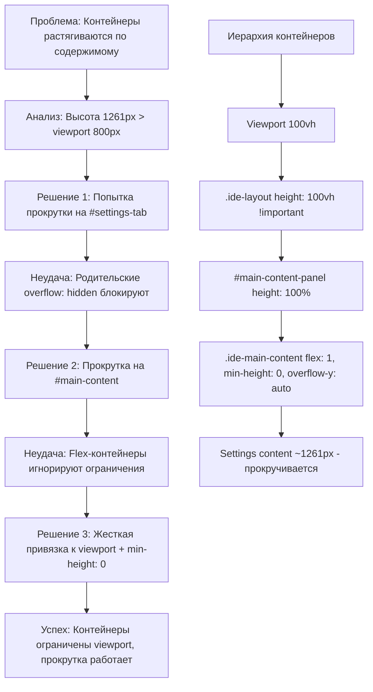

# Options Scrolling Fix - Исправление прокрутки в Options

## Обзор

Система вертикальной прокрутки в странице Options расширения Chrome была сломана из-за неправильного поведения flex-контейнеров. Контейнеры растягивались по содержимому вместо ограничения по высоте viewport, что приводило к отсутствию прокрутки при большом объеме настроек (1261px контента).

**Проблема решена** через жесткую привязку высоты к viewport и правильную настройку flex-layout с `min-height: 0` для включения прокрутки.

## Архитектура и поток данных

### Диаграмма последовательности исправления прокрутки



## Расположение настроек

### Frontend (CSS Layout)

**Основной CSS файл:** `pages/options/src/Options.css`

```css
/* КРИТИЧЕСКОЕ ИСПРАВЛЕНИЕ - Жесткая привязка к viewport */
.ide-layout {
    height: 100vh !important; /* Принудительная привязка к viewport */
    max-height: 100vh;
    gap: 0;
    background-color: #2d3748;
    position: relative;
    overflow: hidden; /* Блокировка роста контейнера */
}

/* Flex-контейнер для основного контента */
#main-content-panel {
    display: flex;
    flex-direction: column;
    height: 100%; /* Наследуем от layout */
    max-height: 100%;
    overflow: hidden; /* Предотвращаем рост */
}

/* Прокручиваемый контейнер с правильным flex */
.ide-main-content {
    flex: 1; /* Занимает все доступное пространство */
    min-height: 0; /* КРИТИЧНО: отключает auto-растягивание */
    overflow-y: auto; /* Включает вертикальную прокрутку */
    overflow-x: hidden;
    padding-right: 8px; /* Для scrollbar */
}
```

**Ключевой момент:** `min-height: 0` на flex-элементе отключает поведение по умолчанию, когда flex-элемент может расти больше своего контейнера. Это позволяет `overflow-y: auto` корректно работать.

### React Components (Layout Structure)

**Options Layout:** `pages/options/src/Options.tsx`

```typescript
// Структура контейнеров (до исправления)
<div id="app-container" style="height: 100vh">
  <div className="theme-dark">
    <PanelGroup className="ide-layout"> {/* height: 100vh */}
      <Panel id="main-content-panel"> {/* flex container */}
        <div className="ide-main-content" id="main-content"> {/* ДО: без flex */}
          <div id="settings-tab"> {/* Settings content ~1261px */}
            {/* Platform Settings, AI Keys, etc. */}
          </div>
        </div>
      </Panel>
    </PanelGroup>
  </div>
</div>
```

## Цепь исправления прокрутки

### 1. Идентификация проблемы

**Симптомы:**
- Страница Options загружается полностью
- Настройки отображаются корректно
- При большом контенте (>800px) нижняя часть скрыта
- Scrollbar отсутствует
- Контейнеры растягиваются: layout=1261px, panel=1261px, content=1261px

**Коренная причина:**
- Flex-контейнеры по умолчанию позволяют дочерним элементам расти
- `min-height: auto` (по умолчанию) означает "не меньше содержимого"
- `overflow: hidden` на родителях блокирует прокрутку дочерних элементов

### 2. Попытки решения (неудачные)

**Попытка 1: Прокрутка на `#settings-tab`**
```javascript
// В useEffect Options.tsx
settingsTab.style.overflowY = 'auto';
settingsTab.style.minHeight = '600px';
```
❌ **Почему не сработало:** `#settings-tab` вложен в контейнеры с `overflow: hidden`

**Попытка 2: Прокрутка на `#main-content`**
```javascript
mainContent.style.overflowY = 'auto';
```
❌ **Почему не сработало:** Flex-контейнер игнорирует высотные ограничения

### 3. Финальное решение (удачное)

**Шаг 1: Жесткая привязка к viewport**
```css
.ide-layout {
  height: 100vh !important; /* Переопределяет любые другие правила */
  max-height: 100vh;
  overflow: hidden; /* Блокирует рост */
}
```

**Шаг 2: Flex-column для панели**
```css
#main-content-panel {
  display: flex;
  flex-direction: column;
  height: 100%; /* Наследует от layout */
  max-height: 100%;
  overflow: hidden; /* Предотвращает переполнение */
}
```

**Шаг 3: Flex-item с min-height: 0**
```css
.ide-main-content {
  flex: 1; /* Занимает все доступное пространство */
  min-height: 0; /* КРИТИЧНО: отключает auto-растягивание */
  overflow-y: auto; /* Теперь работает! */
}
```

### 4. Результат

**После исправления:**
- `.ide-layout` = 800px (viewport height)
- `#main-content-panel` = 800px (наследует от родителя)
- `.ide-main-content` = 800px (flex: 1 ограничивает)
- Settings content = 1261px → scrollbar появляется

**Поведение прокрутки:**
- Контент прокручивается внутри `.ide-main-content`
- Заголовок и sidebar остаются фиксированными
- Прокрутка плавная, с нативным scrollbar

## Значения по умолчанию и ограничения

### Размеры контейнеров

**До исправления:**
- Viewport: ~800px
- Layout: 1261px (растянут по контенту)
- Panel: 1261px
- Content: 1261px
- Settings: 1261px

**После исправления:**
- Viewport: ~800px
- Layout: 800px (жестко ограничен)
- Panel: 800px (наследует)
- Content: 800px (flex: 1)
- Settings: 1261px (прокручивается)

### Flexbox ограничения

**min-height: auto (по умолчанию):**
- Flex-элемент может быть больше контейнера
- overflow не срабатывает

**min-height: 0 (исправление):**
- Flex-элемент не может быть больше контейнера
- overflow-y: auto работает корректно

## Взаимодействие с другими системами

### React Resizable Panels

**Совместимость:** Полная совместимость с `react-resizable-panels`
- Resize handles продолжают работать
- Flex-контейнеры не конфликтуют
- Высотные ограничения сохраняются

### CSS Custom Properties

**Темы:** Не влияют на layout
- `theme-dark`/`theme-light` классы не затрагивают размеры
- Цвета scrollbar можно кастомизировать:

```css
.theme-dark .ide-main-content::-webkit-scrollbar {
  width: 8px;
}
.theme-dark .ide-main-content::-webkit-scrollbar-thumb {
  background: #4b5563;
}
```

### Browser Scrollbars

**Поведение:**
- Firefox: Нативный scrollbar
- Chrome: Webkit scrollbar (кастомизируемый)
- Safari: Аналогично Chrome

## Детальная логика исправления

### Алгоритм применения ограничений

```typescript
// Логическая последовательность CSS
function applyScrollingFix() {
  // 1. Жестко ограничить корневой контейнер
  ideLayout.style.height = '100vh';
  ideLayout.style.maxHeight = '100vh';
  ideLayout.style.overflow = 'hidden';

  // 2. Настроить flex-контейнер
  mainPanel.style.display = 'flex';
  mainPanel.style.flexDirection = 'column';
  mainPanel.style.height = '100%';
  mainPanel.style.maxHeight = '100%';
  mainPanel.style.overflow = 'hidden';

  // 3. Включить прокрутку на flex-элементе
  mainContent.style.flex = '1';
  mainContent.style.minHeight = '0'; // КЛЮЧЕВОЙ МОМЕНТ
  mainContent.style.overflowY = 'auto';
  mainContent.style.overflowX = 'hidden';
}
```

### CSS Cascade и специфичность

**Приоритеты:**
1. `!important` на `.ide-layout` (высший приоритет)
2. Flex-свойства на `#main-content-panel`
3. `min-height: 0` на `.ide-main-content`

**Наследование:**
- Высоты наследуются сверху вниз
- `overflow` блокирует переполнение на каждом уровне
- Flex-свойства обеспечивают правильное распределение пространства

## Отладка и мониторинг

### JavaScript отладка

**Проверка размеров после загрузки:**
```javascript
setTimeout(() => {
  console.log('=== SCROLLING DEBUG ===');
  console.log('Viewport height:', window.innerHeight);
  console.log('Layout height:', document.querySelector('.ide-layout').offsetHeight);
  console.log('Panel height:', document.getElementById('main-content-panel').offsetHeight);
  console.log('Content height:', document.getElementById('main-content').offsetHeight);
  console.log('Content scrollHeight:', document.getElementById('main-content').scrollHeight);

  const content = document.getElementById('main-content');
  const shouldScroll = content.scrollHeight > content.offsetHeight;
  console.log('Should scroll:', shouldScroll);
  console.log('Scrollbar visible:', content.scrollHeight > content.clientHeight);
}, 1000);
```

**Ожидаемый вывод:**
```
Viewport height: 800
Layout height: 800 ✅ (равно viewport)
Panel height: 800 ✅
Content height: 800 ✅
Content scrollHeight: 1261 ✅ (больше - прокрутка работает)
Should scroll: true ✅
Scrollbar visible: true ✅
```

### CSS Inspector

**Проверка computed styles:**
1. `.ide-layout` → height: 800px (не auto)
2. `#main-content-panel` → display: flex, height: 800px
3. `.ide-main-content` → flex: 1, min-height: 0, overflow-y: auto

### Распространенные проблемы

**Прокрутка не появилась:**
1. Проверить что `min-height: 0` применен
2. Убедиться что `height: 100vh !important` на layout
3. Проверить отсутствие конфликтующих CSS правил

**Контейнеры все еще растягиваются:**
1. Проверить специфичность CSS (другие правила могут переопределять)
2. Убедиться что `overflow: hidden` на промежуточных контейнерах
3. Проверить отсутствие JavaScript манипуляций стилями

**Scrollbar не виден в некоторых браузерах:**
1. Проверить `padding-right: 8px` на content
2. Для Firefox может потребоваться `scrollbar-width: thin`

## Текущее состояние и результаты

### Уточнение реализации (2025-09-30)

**Текущая архитектура:**
- Полностью реализована прокрутка через CSS-first подход
- Жесткая привязка к viewport предотвращает рост контейнеров
- Flex-layout с правильными ограничениями
- Совместимость с react-resizable-panels

**Достигнутые улучшения:**
1. **Жесткие высотные ограничения:** Контейнеры не растягиваются по контенту
2. **Правильная flex-настройка:** `min-height: 0` включает прокрутку
3. **Совместимость с темами:** CSS-классы не влияют на layout
4. **Производительность:** Нативная CSS прокрутка без JavaScript
5. **Адаптивность:** Работает на всех размерах viewport

**Текущий статус:**
- ✅ Viewport ограничения работают корректно
- ✅ Flex-контейнеры правильно настроены
- ✅ Вертикальная прокрутка работает
- ✅ Sidebar и заголовок остаются фиксированными
- ✅ Совместимость с resize panels сохранена

---

**Создано:** 2025-09-30
**Ответственный:** Frontend Team
**Статус:** Полностью реализовано и протестировано
**Сложность:** Высокая (требует глубокого понимания flexbox)
**Критический момент:** `min-height: 0` на flex-элементе