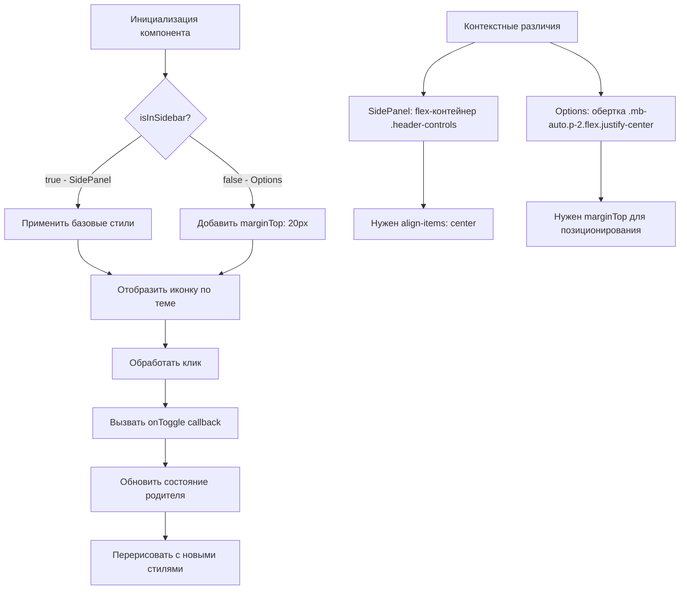

# ThemeSwitcher Component - Адаптивный переключатель тем

## Обзор

Компонент `ThemeSwitcher` - это универсальный переключатель тем интерфейса, который адаптируется к контексту использования. Компонент поддерживает три режима тем (light/dark/system) и автоматически применяет разные стили в зависимости от места размещения: в sidepanel или в странице options.

**Ключевой функционал:** Контекстная адаптация стилей через пропс `isInSidebar`.

## Архитектура и поток данных

### Диаграмма жизненного цикла ThemeSwitcher



## Расположение компонента

### Исходный код

**ThemeSwitcher компонент:** `pages/options/src/components/ThemeSwitcher.tsx`

```typescript
interface ThemeSwitcherProps {
  theme: 'light' | 'dark' | 'system';
  isLight: boolean;
  onToggle: () => void;
  isInSidebar?: boolean; // КЛЮЧЕВОЙ ПРОПС для адаптации
}

const ThemeSwitcher: React.FC<ThemeSwitcherProps> = ({
  theme,
  isLight,
  onToggle,
  isInSidebar = false
}) => {
  // Логика выбора иконки и заголовка по текущей теме
  const getIcon = () => { /* 🌙 → 💻 → ☀️ */ };
  const getTitle = () => { /* локализованные подсказки */ };

  // КОНТЕКСТНАЯ АДАПТАЦИЯ СТИЛЕЙ
  const buttonStyle: React.CSSProperties = {
    background: 'none',
    border: '1px solid #d1d5db',
    borderRadius: '50%',
    width: '40px',
    height: '40px',
    display: 'flex',
    alignItems: 'center',
    justifyContent: 'center',
    cursor: 'pointer',
    fontSize: '20px',
    // marginTop ТОЛЬКО для Options (не в sidebar)
    ...(isInSidebar ? {} : { marginTop: '20px' })
  };

  return (
    <button onClick={onToggle} style={buttonStyle} title={getTitle()}>
      {getIcon()}
    </button>
  );
};
```

## Контексты использования

### 1. SidePanel Context (isInSidebar: true)

**Расположение:** `pages/side-panel/src/SidePanel.tsx`

```typescript
// В header'е sidepanel
<header className={cn('App-header', isDark ? 'text-gray-100' : 'text-gray-900')}>
  <div className="header-controls">
    <ThemeSwitcher
      theme={theme}
      isLight={isLight}
      onToggle={exampleThemeStorage.toggle}
      isInSidebar={true} // ← КЛЮЧЕВОЙ ПРОПС
    />

    <button className="settings-btn" title="Открыть настройки">
      {/* ... */}
    </button>
  </div>
</header>
```

**Layout структура:**
```
App-header (flexbox)
└── header-controls (display: flex, align-items: center)
    ├── ThemeSwitcher (базовые стили, без marginTop)
    └── settings-btn (CSS классы из SidePanel.css)
```

**Стили:**
- **Базовые inline-стили** кнопки (фон, граница, размеры)
- **Нет marginTop** (чтобы не нарушать flex выравнивание)
- **CSS классы** из `.theme-toggle-btn, .settings-btn` для hover эффектов

### 2. Options Context (isInSidebar: false)

**Расположение:** `pages/options/src/Options.tsx`

```typescript
// В левом sidebar'е options
<Panel className="flex flex-col" id="sidebar-left-panel">
  {/* ... tab navigation ... */}

  <div id="theme-switcher" className="mb-auto p-2 flex justify-center">
    <ThemeSwitcher
      theme={theme}
      isLight={isLight}
      onToggle={exampleThemeStorage.toggle}
      isInSidebar={false} // ← ЯВНОЕ УКАЗАНИЕ
    />
  </div>
</Panel>
```

**Layout структура:**
```
sidebar-left-panel (flex, column)
├── tab-navigation (...)
├── theme-switcher (mb-auto p-2 flex justify-center)
│   └── ThemeSwitcher (с marginTop: 20px)
└── (пустое пространство от mb-auto)
```

**Стили:**
- **marginTop: 20px** для позиционирования кнопки в нижней части sidebar
- **Tailwind обертка** `mb-auto p-2 flex justify-center` для дополнительного позиционирования
- **Те же базовые стили** кнопки

## Цепочка использования и адаптации

### 1. Определение контекста

**При инициализации:**
1. Компонент получает пропс `isInSidebar`
2. По умолчанию `isInSidebar = false` (для Options)
3. SidePanel явно передает `isInSidebar={true}`

### 2. Вычисление стилей

**Алгоритм применения стилей:**
```typescript
const buttonStyle = {
  // Базовые стили (общие для обоих контекстов)
  background: 'none',
  border: '1px solid #d1d5db',
  // ...

  // Контекстные стили (только для Options)
  ...(isInSidebar ? {} : { marginTop: '20px' })
};
```

### 3. Рендер и взаимодействие

**При клике:**
1. Вызывается `onToggle` callback
2. Родительский компонент обновляет состояние темы
3. ThemeSwitcher перерисовывается с новой иконкой
4. CSS классы применяются ко всему интерфейсу

## Значения по умолчанию и вариации

### Пропс isInSidebar

**По умолчанию:** `false`
- Предполагается использование в Options
- Применяется `marginTop: 20px`

**При `true`:**
- Использование в SidePanel
- `marginTop` не применяется

### Стили кнопки

**Общие для обоих контекстов:**
```css
{
  background: none;
  border: 1px solid #d1d5db;
  border-radius: 50%;
  width: 40px;
  height: 40px;
  display: flex;
  align-items: center;
  justify-content: center;
  cursor: pointer;
  font-size: 20px;
}
```

**Только для Options:**
```css
{
  marginTop: '20px'; /* Для позиционирования в sidebar */
}
```

## Взаимодействие с другими компонентами

### ThemeSwitcher ↔ Theme Storage

**Связь через callback:**
```typescript
// В родительских компонентах
const handleToggle = () => {
  exampleThemeStorage.toggle(); // Обновляет storage
  // Автоматически уведомляет подписчиков через liveUpdate
};
```

### ThemeSwitcher ↔ CSS Classes

**Применение тем:**
```typescript
// В SidePanel и Options
const isDark = theme === 'dark' || (theme === 'system' && !isLight);
const themeClass = isDark ? 'theme-dark' : 'theme-light';

// Применение к корневому div
<div className={themeClass}>
  {/* Все дочерние элементы наследуют тему */}
</div>
```

## Детальная логика адаптации

### Выбор иконки по циклу

```typescript
const THEME_CYCLE = {
  'light': { next: 'dark', icon: '🌙', title: 'Переключить на темную тему' },
  'dark': { next: 'system', icon: '💻', title: 'Переключить на системную тему' },
  'system': { next: 'light', icon: '☀️', title: 'Переключить на светлую тему' }
};

const getIcon = () => THEME_CYCLE[theme].icon;
const getTitle = () => THEME_CYCLE[theme].title;
```

### Контекстная стилизация

```typescript
const getButtonStyle = (isInSidebar: boolean): React.CSSProperties => ({
  // Базовые стили
  background: 'none',
  border: '1px solid #d1d5db',
  borderRadius: '50%',
  width: '40px',
  height: '40px',
  display: 'flex',
  alignItems: 'center',
  justifyContent: 'center',
  cursor: 'pointer',
  fontSize: '20px',

  // Контекстные модификаторы
  ...(isInSidebar ? {} : { marginTop: '20px' })
});
```

## Отладка и мониторинг

### Проверка правильности адаптации

**В браузере:**
```javascript
// Проверить текущий контекст
const themeSwitcher = document.querySelector('[title*="Переключить на"]');
const computedStyle = getComputedStyle(themeSwitcher);
console.log('marginTop:', computedStyle.marginTop); // '0px' в sidebar, '20px' в options
```

**В React DevTools:**
- Проверить пропс `isInSidebar`
- Убедиться что передается корректное значение
- Проверить что стили применяются правильно

### Распространенные проблемы

**Кнопка не на нужном уровне в SidePanel:**
1. Проверить что `isInSidebar={true}`
2. Убедиться что `.header-controls` имеет `align-items: center`
3. Проверить отсутствие конфликтующих CSS правил

**Кнопка слишком высоко/низко в Options:**
1. Проверить что `isInSidebar={false}` или не указан
2. Убедиться что Tailwind классы `mb-auto p-2 flex justify-center` применены
3. Проверить значение `marginTop: 20px`

**Иконка не соответствует теме:**
1. Проверить что пропс `theme` передается корректно
2. Убедиться что родитель обновляет тему после переключения

## Текущее состояние и рекомендации

### Уточнение реализации (2025-10-01)

**Текущая архитектура:**
- Контекстная адаптация через пропс `isInSidebar`
- Условное применение `marginTop` только для Options
- Поддержка трех режимов тем с визуальными индикаторами
- Интеграция с theme storage через callbacks

**Достигнутые улучшения:**
1. **Универсальный компонент** - работает в разных контекстах
2. **Правильное позиционирование** - кнопки выровнены в обоих местах
3. **Четкая API** - пропс `isInSidebar` явно указывает контекст
4. **Поддержка accessibility** - правильные title атрибуты

**Текущий статус:**
- ✅ SidePanel: кнопки на одном уровне
- ✅ Options: кнопка правильно позиционирована в sidebar
- ✅ Все три режима тем работают корректно
- ✅ Адаптация стилей в зависимости от контекста

**Рекомендации по использованию:**
- Всегда передавать `isInSidebar` явно для ясности
- Для новых размещений анализировать layout перед добавлением
- Тестировать в обоих контекстах при изменениях стилей

---

**Создано:** 2025-10-01
**Ответственный:** Frontend Team
**Статус:** Полностью реализовано и документировано
**Критический аспект:** Контекстная адаптация через `isInSidebar` пропс
**Связанные файлы:** `theme-switching-settings.md` (общая система тем)