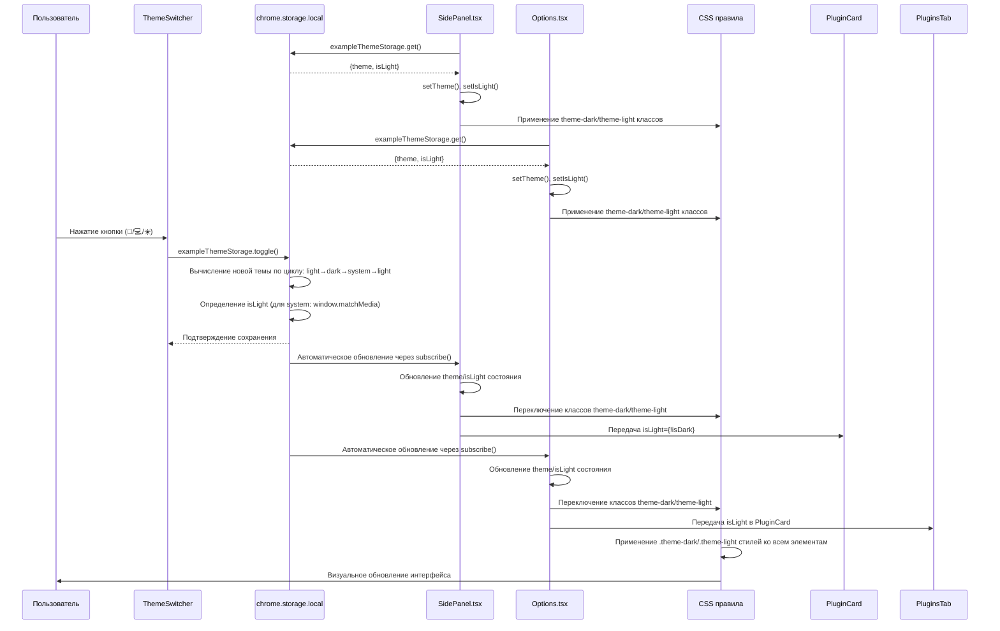

# Theme Switching Settings - Настройки переключения тем

## Обзор

Система переключения тем позволяет пользователям выбирать между светлой, темной и системной темой интерфейса в расширениях Chrome. Система поддерживает три режима: 'light' (светлая), 'dark' (темная) и 'system' (системная тема ОС). Переключение тем применяется к sidepanel и странице options, включая все компоненты интерфейса (карточки плагинов, настройки, кнопки и формы).

## Архитектура и поток данных

### Диаграмма последовательности переключения тем



## Расположение настроек

### Frontend (Пользовательский интерфейс)

**Компонент переключателя тем:** `pages/options/src/components/ThemeSwitcher.tsx`

```typescript
interface ThemeSwitcherProps {
  theme: 'light' | 'dark' | 'system';
  isLight: boolean;
  onToggle: () => void;
}

// Цикл переключения: light → dark → system → light
const getIcon = () => {
  switch (theme) {
    case 'light': return '🌙'; // К dark
    case 'dark': return '💻'; // К system
    case 'system': return '☀️'; // К light
  }
};
```

**Side Panel:** `pages/side-panel/src/SidePanel.tsx`

```typescript
// Состояние темы
const [theme, setTheme] = useState<Theme>('system');
const [isLight, setIsLight] = useState(true);

// Загрузка и подписка на изменения
useEffect(() => {
  const loadTheme = async () => {
    const state = await exampleThemeStorage.get();
    setTheme(state.theme);
    setIsLight(state.isLight);
  };

  loadTheme();
  const unsubscribe = exampleThemeStorage.subscribe(loadTheme);
  return unsubscribe;
}, []);

// Применение темы к компоненту
const isDark = theme === 'dark' || (theme === 'system' && !isLight);

// Рендер с theme классами
<div className={cn('App', isDark ? 'bg-gray-800' : 'bg-slate-50')}>
  <header className={cn('App-header', isDark ? 'text-gray-100' : 'text-gray-900')}>
    <ThemeSwitcher theme={theme} isLight={isLight} onToggle={exampleThemeStorage.toggle} />
  </header>

  {/* Передача isLight в PluginCard */}
  <PluginCard isLight={!isDark} ... />
</div>
```

**Options Page:** `pages/options/src/Options.tsx`

```typescript
// Состояние темы
const [theme, setTheme] = useState<'light' | 'dark' | 'system'>('system');
const [isLight, setIsLight] = useState(true);
const themeClass = theme === 'dark' || (theme === 'system' && !isLight) ? 'theme-dark' : 'theme-light';

// Загрузка и подписка
useEffect(() => {
  const loadTheme = async () => {
    const state = await exampleThemeStorage.get();
    setTheme(state.theme);
    setIsLight(state.isLight);
  };

  loadTheme();
  const unsubscribe = exampleThemeStorage.subscribe(loadTheme);
  return unsubscribe;
}, []);

// Рендер с theme классом
<div className={themeClass}>
  <PanelGroup className="ide-layout">
    {/* Theme Switcher в сайдбаре */}
    <ThemeSwitcher theme={theme} isLight={isLight} onToggle={exampleThemeStorage.toggle} />

    {/* Передача isLight в компоненты */}
    <PluginsTab isLight={isLight} ... />
  </PanelGroup>
</div>
```

### Storage Layer (Хранилище настроек)

**Хранилище тем:** `packages/storage/lib/impl/example-theme-storage.ts`

```typescript
// Начальное состояние по умолчанию
const storage = createStorage<ThemeStateType>(
  'theme-storage-key',
  {
    theme: 'system',  // По умолчанию системная тема
    isLight: getSystemTheme(), // Определение текущей системной темы
  },
  {
    storageEnum: StorageEnum.Local,
    liveUpdate: true, // Включает автоматические обновления подписчиков
  },
);

// Функция определения системной темы
function getSystemTheme(): boolean {
  if (typeof window !== 'undefined' && window.matchMedia) {
    return window.matchMedia('(prefers-color-scheme: light)').matches;
  }
  return true; // По умолчанию светлая тема
}

// Метод переключения по циклу
export const exampleThemeStorage: ThemeStorageType = {
  ...storage,
  toggle: async () => {
    await storage.set(currentState => {
      let newTheme: 'light' | 'dark' | 'system';

      switch (currentState.theme) {
        case 'light': newTheme = 'dark'; break;
        case 'dark': newTheme = 'system'; break;
        case 'system':
        default: newTheme = 'light'; break;
      }

      // Для системной темы определяем isLight динамически
      const isLight = newTheme === 'system' ? getSystemTheme() : newTheme === 'light';

      return { theme: newTheme, isLight };
    });
  },
};
```

## Цепь использования настройки

### 1. Инициализация

**При первом запуске расширения:**
1. `exampleThemeStorage` создается с начальными значениями: `{theme: 'system', isLight: getSystemTheme()}`
2. Настройки сохраняются в `chrome.storage.local` под ключом `'theme-storage-key'`
3. Live update включен для автоматического уведомления подписчиков

**При открытии sidepanel/options:**
1. Компонент вызывает `exampleThemeStorage.get()` для загрузки сохраненных настроек
2. Подписывается на изменения через `exampleThemeStorage.subscribe()`
3. Устанавливает theme и isLight состояния React компонентов
4. Применяет CSS классы к корневому элементу

### 2. Переключение темы

**При нажатии кнопки ThemeSwitcher:**
1. Вызывается `exampleThemeStorage.toggle()`
2. Метод вычисляет новую тему по циклу: light → dark → system → light
3. Для системной темы `isLight` определяется через `window.matchMedia('(prefers-color-scheme: light)')`
4. Новые значения сохраняются в chrome.storage.local
5. Все подписчики автоматически уведомляются об изменениях

**Реактивное обновление интерфейса:**
1. SidePanel/Options получают обновление через subscribe callback
2. Обновляются React состояния theme и isLight
3. Пересчитывается themeClass: `'theme-dark'` или `'theme-light'`
4. CSS класс применяется к корневому div
5. Все дочерние элементы наследуют темную/светлую тему через CSS правила

### 3. Работа с компонентами

**PluginCard компоненты:**
- Получают `isLight` проп из родительских компонентов
- Используют CSS классы вместо inline стилей для тем
- Темная тема: `plugin-card.dark` класс применяется автоматически

**Settings компоненты:**
- Все элементы форм (inputs, selects, buttons) имеют `.theme-dark` правила
- Цвета фона, текста, границ изменяются в зависимости от темы
- Toggle switches и чекбоксы адаптируют цвета

### 4. CSS правила тем

**Базовые правила:** `pages/options/src/Options.css`, `pages/side-panel/src/SidePanel.css`

```css
/* Light theme (default) */
.theme-light .ide-layout { background-color: var(--color-bg-light); }
.theme-light .plugin-item { background-color: #fff; border-color: #e2e8f0; }
.theme-light input { background-color: white; border-color: #e2e8f0; }

/* Dark theme */
.theme-dark .ide-layout { background-color: var(--color-bg-dark); }
.theme-dark .plugin-item { background-color: #4a5568; border-color: #718096; }
.theme-dark input { background-color: #4a5568; border-color: #718096; color: #e2e8f0; }

/* Settings specific dark theme rules */
.theme-dark .settings-section { background-color: #4a5568; border-color: #718096; }
.theme-dark .ai-key-item { background-color: #2d3748; border-color: #718096; }
.theme-dark .toggle-slider { background: #718096; }
```

## Режимы тем

### Light Mode (Светлая тема)
- **Иконка:** ☀️ (солнце)
- **Цвета:** Белые фоны, темный текст, светло-серые границы
- **Применение:** Явное предпочтение светлого интерфейса

### Dark Mode (Темная тема)
- **Иконка:** 💻 (монитор)
- **Цвета:** Темно-серые фоны, светлый текст, темные границы
- **Применение:** Явное предпочтение темного интерфейса

### System Mode (Системная тема)
- **Иконка:** 🌙 (луна)
- **Цвета:** Автоматически определяются из настроек ОС
- **Применение:** Следование системным предпочтениям пользователя

## Значения по умолчанию

### Новые установки
- **theme:** `'system'` (системная тема по умолчанию)
- **isLight:** Определяется через `window.matchMedia('(prefers-color-scheme: light)')`

### Существующие установки
- Сохраняют свои настройки в `chrome.storage.local`
- При обновлении расширения настройки сохраняются

## Взаимодействие с другими системами

### Chrome Storage API
- **Хранилище:** `chrome.storage.local` с ключом `'theme-storage-key'`
- **Формат данных:**
  ```json
  {
    "theme-storage-key": {
      "theme": "system",
      "isLight": true
    }
  }
  ```
- **Live updates:** Включены для синхронизации между вкладками

### React State Management
- **SidePanel:** Локальные состояния `theme` и `isLight`
- **Options:** Локальные состояния `theme` и `isLight`
- **Синхронизация:** Через storage subscribe callbacks

### CSS Custom Properties
- **Переменные для цветов:**
  ```css
  :root {
    --color-bg-light: #f7fafc;
    --color-bg-dark: #1a202c;
    --color-text-light: #1a202c;
    --color-text-dark: #e2e8f0;
  }
  ```
- **Использование:** `var(--color-bg-dark)` для консистентности

## Детальная логика переключения

### Алгоритм toggle метода

```typescript
function toggleTheme(currentTheme: 'light' | 'dark' | 'system'): {theme: string, isLight: boolean} {
  let newTheme: 'light' | 'dark' | 'system';

  switch (currentTheme) {
    case 'light':
      newTheme = 'dark';
      break;
    case 'dark':
      newTheme = 'system';
      break;
    case 'system':
    default:
      newTheme = 'light';
      break;
  }

  // Определение isLight
  const isLight = newTheme === 'system'
    ? window.matchMedia('(prefers-color-scheme: light)').matches
    : newTheme === 'light';

  return { theme: newTheme, isLight };
}
```

### Определение текущей темы для рендера

```typescript
// В компонентах
const isDarkTheme = theme === 'dark' || (theme === 'system' && !isLight);
const themeClass = isDarkTheme ? 'theme-dark' : 'theme-light';
```

### CSS селекторы для тем

**Приоритет применения:**
1. `.theme-dark` правила имеют больший приоритет
2. `.theme-light` правила для явного светлого режима
3. Базовые правила без префиксов для fallback

**Наследование:**
- Корневой элемент получает класс `theme-dark` или `theme-light`
- Все дочерние элементы наследуют тему через CSS cascade
- Специфические компоненты могут иметь дополнительные правила

## Отладка и мониторинг

### Логи в консоли

**ThemeSwitcher:**
```javascript
console.log('[ThemeSwitcher] Toggle clicked, current theme:', theme);
```

**Storage operations:**
```javascript
console.log('[exampleThemeStorage] Setting theme:', {theme, isLight});
console.log('[exampleThemeStorage] Notifying subscribers');
```

**Component updates:**
```javascript
console.log('[SidePanel] Theme updated:', {theme, isLight, isDark});
```

### Chrome DevTools

**Проверка storage:**
```javascript
chrome.storage.local.get('theme-storage-key').then(result => console.log(result));
```

**Проверка CSS классов:**
- Inspect элемент → Проверить наличие `theme-dark` или `theme-light` класса
- Computed styles → Проверить применение CSS переменных

### Распространенные проблемы

**Тема не применяется:**
1. Проверить наличие CSS правил для `.theme-dark`/`.theme-light`
2. Убедиться что корневой элемент имеет правильный класс
3. Проверить что `isLight` правильно рассчитывается

**Storage не сохраняется:**
1. Проверить разрешения `chrome.storage` в manifest.json
2. Проверить логи в background script
3. Убедиться что `liveUpdate: true` в конфигурации storage

**Системная тема не работает:**
1. Проверить `window.matchMedia('(prefers-color-scheme: light)')`
2. Убедиться что функция `getSystemTheme()` возвращает правильное значение
3. Проверить изменение темы при смене системных настроек

## Текущее состояние и известные проблемы

### Уточнение реализации (2025-09-30)

**Текущая архитектура:**
- Полностью реализована поддержка трех режимов тем
- Синхронизация между sidepanel и options через shared storage
- CSS-first подход с классами вместо inline стилей
- Live updates для мгновенного применения изменений

**Достигнутые улучшения:**
1. **Единая система хранения:** `exampleThemeStorage` с live updates
2. **Консистентный UI:** ThemeSwitcher компонент переиспользуется
3. **Полная поддержка CSS:** Все компоненты адаптированы для тем
4. **Системная тема:** Автоматическое определение настроек ОС
5. **Реактивные обновления:** Изменения применяются мгновенно

**Текущий статус:**
- ✅ Светлая тема работает корректно
- ✅ Темная тема работает корректно
- ✅ Системная тема работает корректно
- ✅ Синхронизация между страницами работает
- ✅ Все компоненты (PluginCard, Settings) адаптированы

---

**Создано:** 2025-09-30
**Ответственный:** Frontend Team
**Статус:** Полностью реализовано и протестировано